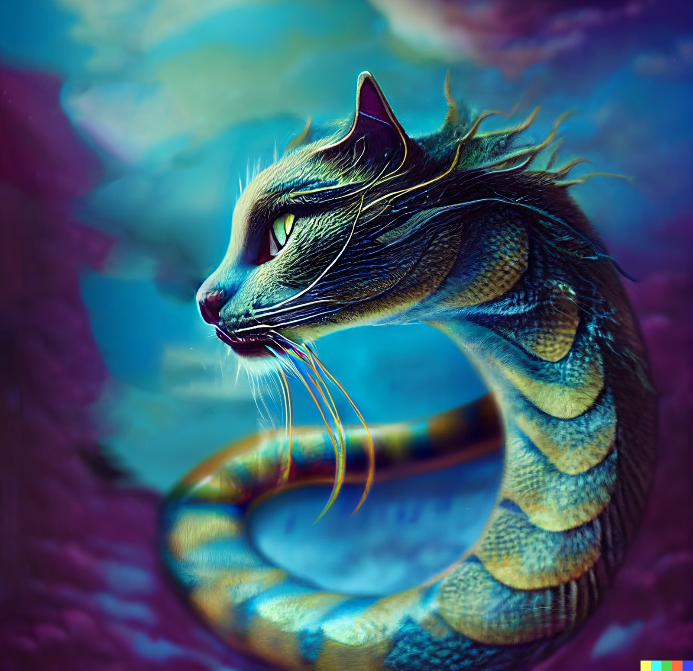

# Motua
:speaker:{ .middle } *(moh-TOO-ah)*  

- :octicons-info-24:{ .lg .middle } __Biographical Information__

    a [gidari](<../../species/children-of-belief/gidari.md>) ([celestial](<../../species/children-of-belief/celestials.md>)), they/them  
    { .bio }

    Originally from: the [Land of the Dead](<../../cosmology/multiverse/spiritual-realms/proximate-realms/land-of-the-dead.md>), the [Spiritual Realms](<../../cosmology/multiverse/spiritual-realms/spiritual-realms.md>)

:octicons-location-24:{ .lg .middle } Last known location (as of December 1748): [Azta Lekua](<../../gazetteer/far-south/azta-lekua.md>), [Orekatu](<../../gazetteer/far-south/orekatu.md>), the South Region

{align="right"; width="400"}One of the guardians of the [Land of the Dead](<../../cosmology/multiverse/spiritual-realms/proximate-realms/land-of-the-dead.md>), a [Gidari](<../../species/children-of-belief/gidari.md>), who is native to the [Land of the Dead](<../../cosmology/multiverse/spiritual-realms/proximate-realms/land-of-the-dead.md>) and serves as a guide and protector of souls on their journey beyond the veil. 

In DR 1747, Motua fought [Grash](<../other-nonhumans/grash.md>) in the [Land of the Dead](<../../cosmology/multiverse/spiritual-realms/proximate-realms/land-of-the-dead.md>), and was wounded, and driven to the material plane. They arrived at the [Footprint of the Gods](<../../gazetteer/far-south/azta-lekua.md>), in pain, wracked by spiritual chains created by the [Ring of Undying](<../../things/artifacts-of-power/ring-of-undying.md>), and unconsciously draining the spiritual essence of [Azta Lekua](<../../gazetteer/far-south/azta-lekua.md>), the Footprint of the Gods. Motua was healed by [Kenzo](<../pcs/dunmar-fellowship/kenzo.md>) and his [lizardfolk](<../../species/children-of-the-embodied-gods/lizardfolk/lizardfolk.md>)allies in DR 1748.

- Jun 11, 1747 DR [Grash](<../other-nonhumans/grash.md>) enters the [Land of the Dead](<../../cosmology/multiverse/spiritual-realms/proximate-realms/land-of-the-dead.md>) to activate the [Ring of Undying](<../../things/artifacts-of-power/ring-of-undying.md>), and encounters [Motua](<./motua.md>). They fight, and [Motua](<./motua.md>) is wounded.
- Nov 06, 1748 DR [Kenzo](<../pcs/dunmar-fellowship/kenzo.md>), [Izzarak](<../pcs/dunmar-fellowship/guests/izzarak.md>), and [Enari](<../lizardfolk/enari.md>) heal [Motua](<./motua.md>).
