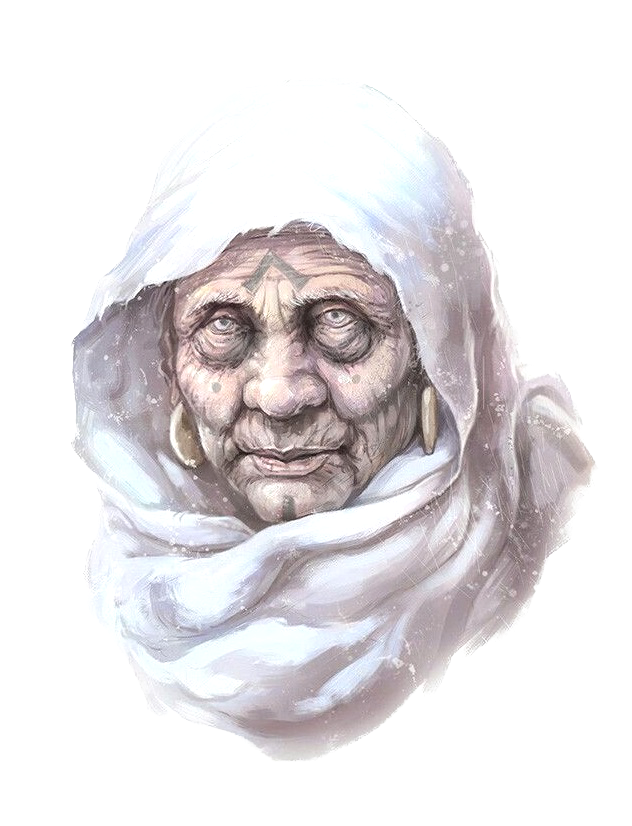

# Agata Dustmother

- :octicons-info-24:{ .lg .middle } __Biographical Information__

    hag ([fey](<../../species/children-of-the-divine/fey/fey.md>)), she/her  
    { .bio }

    Originally from: Unknown

:octicons-location-24:{ .lg .middle } Currently in the [Heartwood Grove](<../../cosmology/multiverse/echo-realms/feywild/heartwood-grove.md>), [Amberglow](<../../cosmology/multiverse/echo-realms/feywild/amberglow.md>), the [Feywild](<../../cosmology/multiverse/echo-realms/feywild/feywild.md>)

:octicons-location-24:{ .lg .middle } Imprisoned by the [Dunmar Fellowship](<../pcs/dunmar-fellowship/dunmar-fellowship.md>) on November 15th, 1748 in the [Heartwood Grove](<../../cosmology/multiverse/echo-realms/feywild/heartwood-grove.md>), [Amberglow](<../../cosmology/multiverse/echo-realms/feywild/amberglow.md>), the [Feywild](<../../cosmology/multiverse/echo-realms/feywild/feywild.md>)  

Agata Dustmother, often referred to as the "Old Woman of the Dusts," is an ancient and cunning fey hag, based for many years on the edge of the [Garamjala Desert](<../../gazetteer/greater-dunmar/garamjala-plateau/garamjala-desert.md>), near [Eastern Dunmar](<../../gazetteer/greater-dunmar/realms/dunmar/eastern-dunmar/eastern-dunmar.md>). 
## Overview

Agata Dustmother, known as the Old Woman of the Dusts, is an ancient fey [hag](<../../primary-sources/story-about-hags.md>) renowned for her plotting and deal-making skills, who always seems to emerge victorious in her bargains. She has dwelt at the edge of the [Garamjala Desert](<../../gazetteer/greater-dunmar/garamjala-plateau/garamjala-desert.md>), in [Eastern Dunmar](<../../gazetteer/greater-dunmar/realms/dunmar/eastern-dunmar/eastern-dunmar.md>), for as long as anyone can remember, luring the desperate and unwary into bargains. She is fascinated by strange and especially gruesome magic, and is a collector of magic items, from the common to the extraordinary. 

In DR 1748, she was imprisoned in the Heartwood Grove in the [Feywild](<../../cosmology/multiverse/echo-realms/feywild/feywild.md>) realm of [Amberglow](<../../cosmology/multiverse/echo-realms/feywild/amberglow.md>) by [Dunmar Fellowship](<../pcs/dunmar-fellowship/dunmar-fellowship.md>). 
## Description
{width="400"}
Agata takes the appearance of a withered old woman, with dry, dusty skin, wearing white robes. Her lair is magical and seemingly un-scryable hut hidden on the edge of the desert, surrounded by brambles and rocks, and only approachable if one follows the correct path. 
## Events

- Agata was known as Dasoclese in the [Feywild](<../../cosmology/multiverse/echo-realms/feywild/feywild.md>) realm of [Amberglow](<../../cosmology/multiverse/echo-realms/feywild/amberglow.md>)
- Agata was rumored to have been an ally of [Cha'mutte](<../extraplanar-powers/cha-mutte.md>) in the [Great War](<../../events/1500s/great-war.md>), focusing on the pain of war refugees and survivors. It was suggested by [Hralgar](<../giants/hralgar.md>) and by [Delios the Sage](<../tollenders/delios-the-sage.md>) that she never forgave the Dunmari for their role in the [Great War](<../../events/1500s/great-war.md>), and her later actions were often driven by vengeance. 
- In the early 1740s, Agata imprisoned Nayan [Sura](<../dunmari/sura.md>) in a magic mirror, triggering a chain of events that led to the ascension of [Nayan Karnas](<../dunmari/nayan-karnas.md>), [Sura](<../dunmari/sura.md>)'s brother, to the Dunmari throne, for mysterious ends.
- Acquired the [Scepter of Command](<../../things/artifacts-of-power/scepter-of-command.md>) from the [Fraternity of the Empty Moon](<../../groups/fraternity-of-the-empty-moon.md>) sometime in 1747 or early 1748, in exchange for assisting the Fraternity in their plan to draw the energy of [Pandemonium](<../../cosmology/multiverse/spiritual-realms/primal-realms/pandemonium.md>) closer to Taelgar, strengthening the curse of lycanthropy and causing madness to spread across [Dunmar](<../../gazetteer/greater-dunmar/realms/dunmar/dunmar.md>). 
- Thought to be killed by [Dunmar Fellowship](<../pcs/dunmar-fellowship/dunmar-fellowship.md>) at [Shakun’s Wellspring](<../../gazetteer/greater-dunmar/realms/dunmar/eastern-dunmar/shakuns-wellspring.md>) on [May 29th, 1748](<../../campaigns/dunmari-frontier/session-notes/session-28-dufr.md>).
- Masqueraded for months as a fey named [Typhina](<./typhina.md>) in the [Ring of the Warded Mind](<../../campaigns/dunmari-frontier/treasure/notable-items/ring-of-the-warded-mind.md>), recounting [Typhina](<./typhina.md>)'s story to [Seeker](<../pcs/dunmar-fellowship/seeker.md>).
- Was finally imprisoned in the Heartwood Grove in [Amberglow](<../../cosmology/multiverse/echo-realms/feywild/amberglow.md>) in the [Feywild](<../../cosmology/multiverse/echo-realms/feywild/feywild.md>) in [November 1748](<../../campaigns/dunmari-frontier/session-notes/session-67-dufr.md>).

## **Other Notes**

- Agata possessed a magical substance called living wood, that she used to turn her victims into wooden puppets and worse. [Jumi](<../dunmari/jumi.md>), [Cintra](<../dunmari/cintra.md>)'s daughter, was in the process of being turned into a wooden mannequin when she was rescued by [Dunmar Fellowship](<../pcs/dunmar-fellowship/dunmar-fellowship.md>) in [ May 1748](<../../campaigns/dunmari-frontier/session-notes/session-29-dufr.md>). Also freed were:
	- [Garret Tealeaf](<../halflings/garret-tealeaf.md>), who had been forced into Agata's service as a wooden scarecrow before being turned back by [Dunmar Fellowship](<../pcs/dunmar-fellowship/dunmar-fellowship.md>) on [June 2, 1748](<../../campaigns/dunmari-frontier/session-notes/session-30-dufr.md>)
	- [Shandar](<../dunmari/shandar.md>), an old man who had been trapped as a table for decades, freed by [Dunmar Fellowship](<../pcs/dunmar-fellowship/dunmar-fellowship.md>) on [June 4, 1748](<../../campaigns/dunmari-frontier/session-notes/session-30-dufr.md>)
	- [Kaya](<../dunmari/kaya.md>), a Dunmari woman who had been trapped as a chair for decades, freed by [Dunmar Fellowship](<../pcs/dunmar-fellowship/dunmar-fellowship.md>) on [June 8, 1748](<../../campaigns/dunmari-frontier/session-notes/session-31-dufr.md>)

