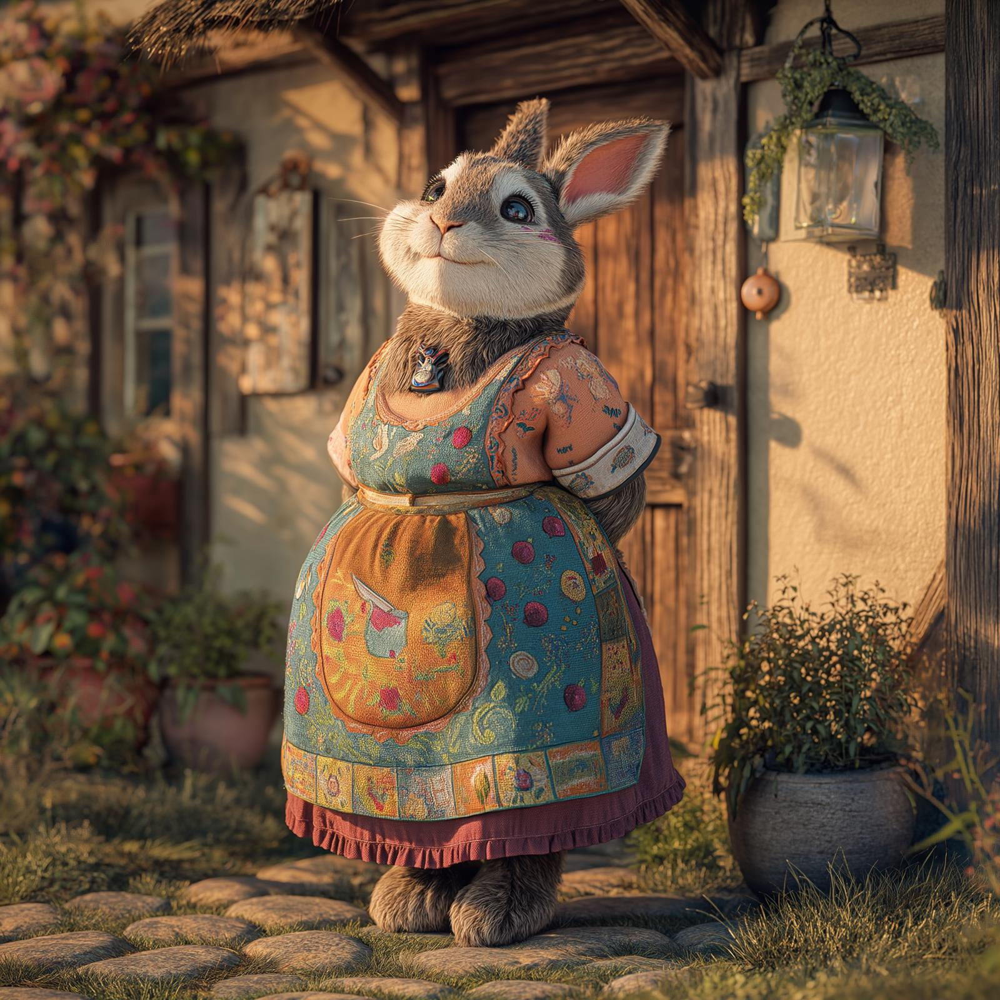

# Auntie Mulberry

- :octicons-info-24:{ .lg .middle } __Biographical Information__

    A [fey](<../../species/extraplanar/fey.md>) (haregon) (she/her)  
    { .bio }

    Based in [Emberwine](<../../gazetteer/extraplanar/feywild/emberwine/emberwine.md>), the [Feywild](<../../cosmology/feywild.md>), [Multiverse](<../../cosmology/multiverse.md>)

:octicons-location-24:{ .lg .middle } Visited by the [Dunmar Fellowship](<../pcs/dunmar-fellowship/dunmar-fellowship.md>) on May 31th, 1749 in [Emberwine](<../../gazetteer/extraplanar/feywild/emberwine/emberwine.md>), the [Feywild](<../../cosmology/feywild.md>), [Multiverse](<../../cosmology/multiverse.md>)  

{align="right"; width="400"}Auntie Mulberry is a haregon -- a half-human, half-rabbit humanoid fey -- who lives a quiet life in a cottage in [Emberwine](<../../gazetteer/extraplanar/feywild/emberwine/emberwine.md>). She enjoys talking to travelers, and is generally friendly and welcoming to those who stop by. 

Her cottage often appears larger on the inside than the outside, but whether this is some trick of the light, a quirk of the [Feywild](<../../cosmology/feywild.md>), or her special magic, she will not say. 