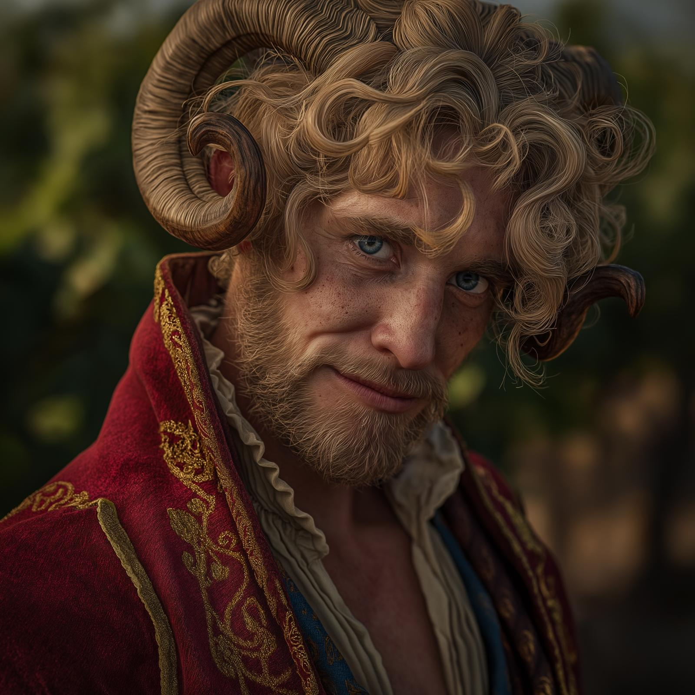

# Valeris

- :octicons-info-24:{ .lg .middle } __Biographical Information__

    A [fey](<../../species/extraplanar/fey.md>) (satyr)  
    { .bio }

    Originally from: [Sunwine Hall](<../../gazetteer/extraplanar/feywild/emberwine/sunwine-hall.md>), [Emberwine](<../../gazetteer/extraplanar/feywild/emberwine/emberwine.md>), the [Feywild](<../../cosmology/feywild.md>)

:octicons-location-24:{ .lg .middle } Last known location (as of June 14th, 1749): [Amberglow](<../../gazetteer/extraplanar/feywild/amberglow/amberglow.md>), the [Feywild](<../../cosmology/feywild.md>), [Multiverse](<../../cosmology/multiverse.md>)

{align="right"; width="300"}Valeris is a satyr, a musician and gambler, cursed to speak only the absolute truth, unable even to sugar coat his words with lies of omission. 

He is lean and rakish, with curling ram’s horns wrapped in gold rings, and half-buttoned silk shirt. His eyes twinkle with mischief he can no longer act on, and his mouth twitches constantly, but whether in irritation or the desperate effort to hold his tongue is hard to tell. 

