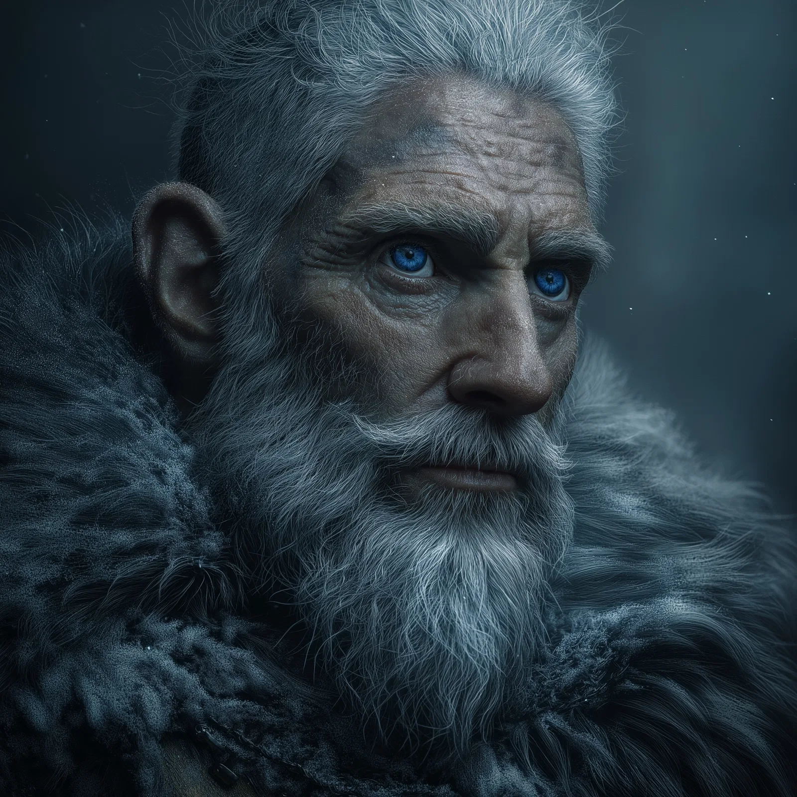

# Algerd

- :octicons-info-24:{ .lg .middle } __Biographical Information__

    A [giant](<../../creatures/species/giants.md>) (frost) (he/him)  
    { .bio }

    Based on [Vindristjarna](<../../things/ships/vindristjarna.md>), in the [Gulf of Chardon](<../../gazetteer/greater-chardon/gulf-of-chardon.md>), the [Endless Ocean](<../../gazetteer/endless-ocean.md>)

{align="right"; width="250"}Algerd is a somewhat absent-minded frost giant historian, originally from [Isenborg](<../../gazetteer/northern-green-sea/isenborg.md>). He has a tendency to focus single-mindedly on whatever happens to be the focus of his attention. He has a sister, who vanished some time ago. 