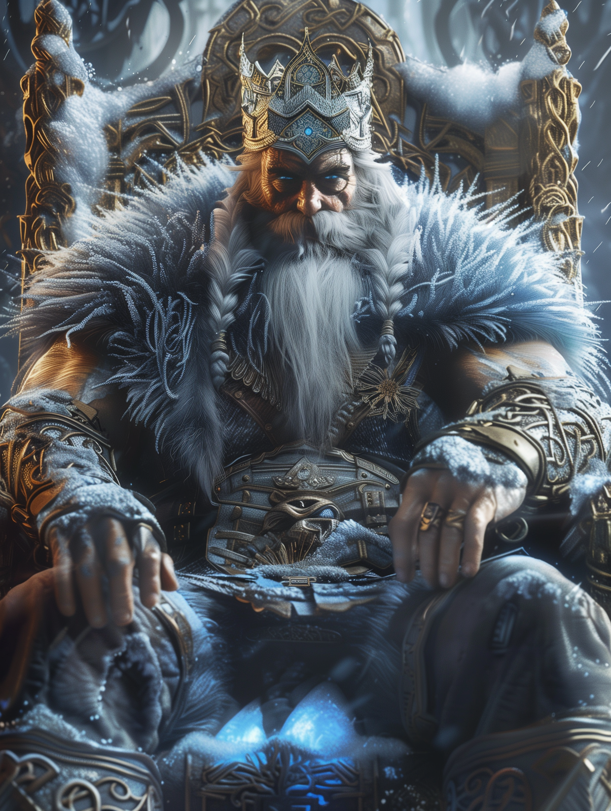

# King Brimskarda

- :octicons-info-24:{ .lg .middle } __Biographical Information__

    A [giant](<../../species/children-of-the-divine/giants.md>) (frost) (he/him)  
    King of [Kaldhalla](<../../gazetteer/northern-green-sea/kaldhalla.md>)  
    { .bio }

{align="right"; width="400"}Brimskarda is a frost giant king, the ruler of the Kingdom of [Kaldhalla](<../../gazetteer/northern-green-sea/kaldhalla.md>), centered in the northern half of the [Svinjo Mountains](<../../gazetteer/northern-green-sea/svinjo-mountains.md>). Though violent and prone to see the world in terms of strength of arms alone, he is also protective of his kingdom and those who have exchanged their service for his protection (not always willingly), and there have been no large-scale dragon attacks on [Kaldhalla](<../../gazetteer/northern-green-sea/kaldhalla.md>) since he established himself as king. 

