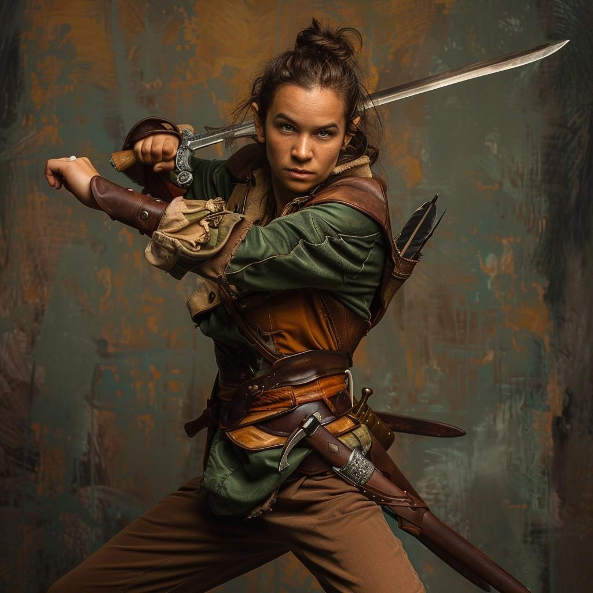

# Adra Brightwood

- :octicons-info-24:{ .lg .middle } __Biographical Information__

    A [halfling](<../../species/halflings.md>) (she/her), of Brightwoods  
    Member of [The Rangers](<../../groups/the-rangers.md>)  
    { .bio }

    Originally from: Unknown

:octicons-location-24:{ .lg .middle } Last known location (as of February 1st, 1720): the [Aveil Ridge](<../../gazetteer/greater-sembara/sembara/barony-of-aveil/aveil-ridge.md>), the [Barony of Aveil](<../../gazetteer/greater-sembara/sembara/barony-of-aveil/barony-of-aveil.md>), [Sembara](<../../gazetteer/greater-sembara/sembara/sembara.md>)

{align="right"; width="400"} A wanderer, woodswalker, and skilled swordswoman. Cousin of [Enzo Brightwood](<./enzo-brightwood.md>).

