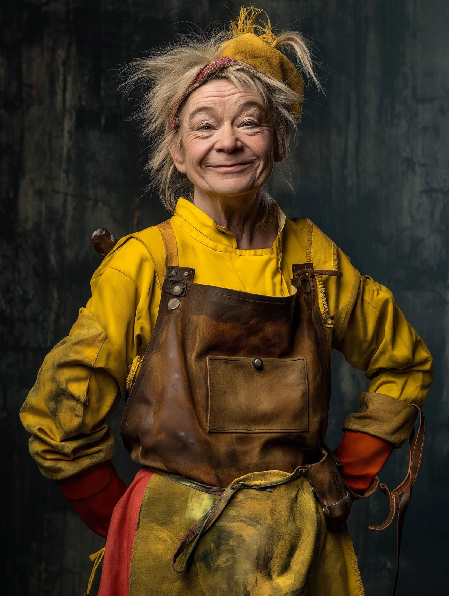

# Callie Riverstone

- :octicons-info-24:{ .lg .middle } __Biographical Information__

    A [halfling](<../../species/children-of-the-embodied-gods/halflings/halflings.md>) (she/her), of the [Riverstones](<../../groups/halfling-families/riverstones.md>)  
    { .bio }

    Based in [Aslain](<../../gazetteer/greater-sembara/sembara/barony-of-aveil/aslain.md>), the [Barony of Aveil](<../../gazetteer/greater-sembara/sembara/barony-of-aveil/barony-of-aveil.md>), [Sembara](<../../gazetteer/greater-sembara/sembara/sembara.md>)

{align="left"; width="200"}

