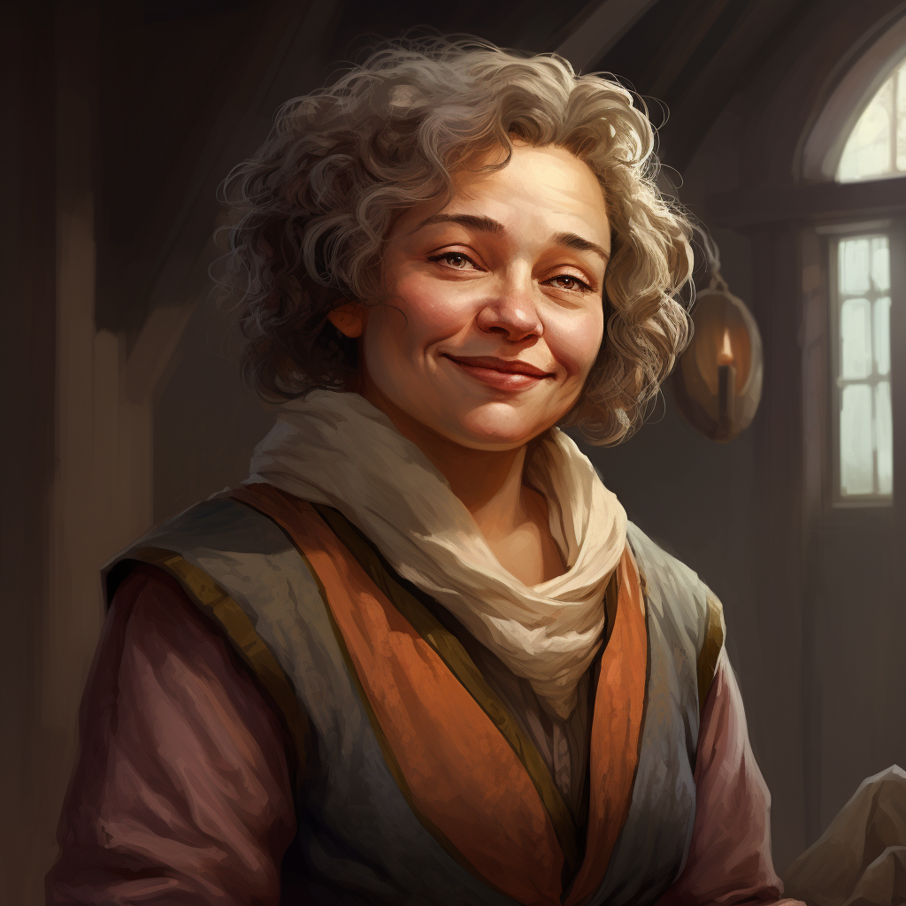

# Chenna Goodbarrel
>[!info]+ Biographical Info
> A [halfling](<../../species/children-of-the-embodied-gods/halflings/halflings.md>) (she/her), of the Goodbarrels
> 
> 
>> 
>>  Met by [Wellby](<../pcs/dunmar-fellowship/wellby.md>) around DR 1730 at [The Singing Fox](<../../gazetteer/western-green-sea/tollen/the-singing-fox.md>), Fairgate Outer 
>>  Met by the [Dunmar Fellowship](<../pcs/dunmar-fellowship/dunmar-fellowship.md>) on December 30th, 1748 on [Vindristjarna](<../../things/ships/vindristjarna.md>), in the [Free City of Tollen](<../../gazetteer/western-green-sea/tollen/tollen.md>) 

Chenna Goodbarrel owns a small and charming halfling tavern in Fairgate Outer called *[The Singing Fox](<../../gazetteer/western-green-sea/tollen/the-singing-fox.md>)*, with her wife [Harriet](<./harriet-goodbarrel.md>). Chenna runs the bar and kitchen; warm, welcoming, and charming, she's the heart of the establishment.
## Relationships
- [Harriet Goodbarrel](<./harriet-goodbarrel.md>), wife
- [Wellby](<../pcs/dunmar-fellowship/wellby.md>), a distant relation, something like a third cousin once removed

