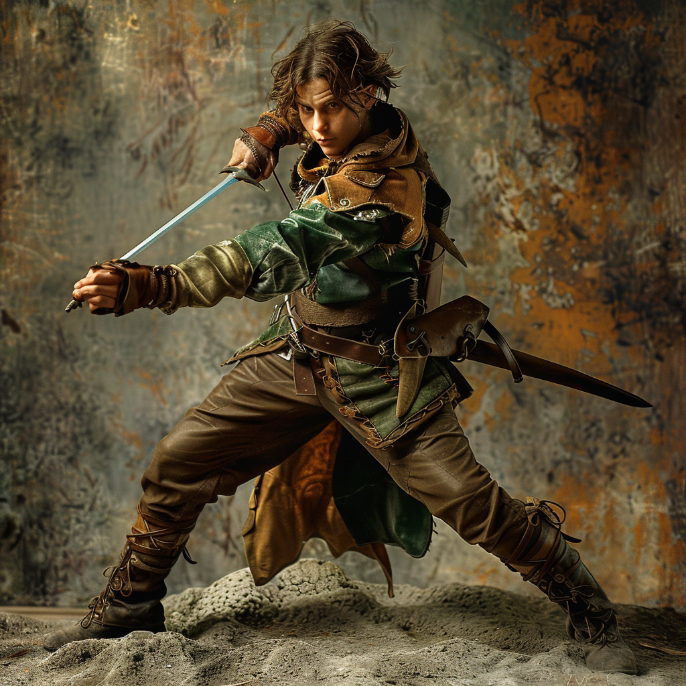

# Enzo Brightwood

- :octicons-info-24:{ .lg .middle } __Biographical Information__

    A [halfling](<../../species/halflings.md>) (he/him), of Brightwoods  
    Member of [The Rangers](<../../groups/the-rangers.md>)  
    { .bio }

    Originally from: Unknown

:octicons-location-24:{ .lg .middle } Last known location (as of January 18th, 1720): [Champimont](<../../gazetteer/greater-sembara/sembara/barony-of-aveil/champimont.md>), the [Barony of Aveil](<../../gazetteer/greater-sembara/sembara/barony-of-aveil/barony-of-aveil.md>), [Sembara](<../../gazetteer/greater-sembara/sembara/sembara.md>)

{align="right"; width="400"}A skirmisher and scout. Young, to be on the road. Cousin of [Adra Brightwood](<./adra-brightwood.md>).

