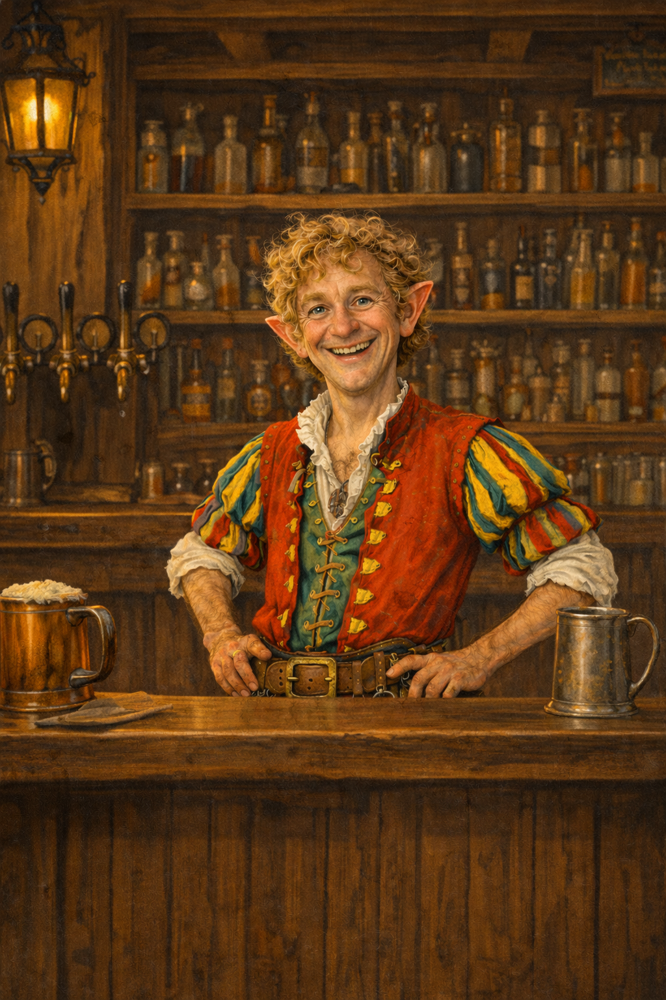

# Finoc Small

- :octicons-info-24:{ .lg .middle } __Biographical Information__

    A [halfling](<../../creatures/species/halflings.md>) (he/him)  
    Proprietor of [The Wandering Toad](<../../gazetteer/northwest-coast/northern-provinces/voltara/the-wandering-toad.md>)  
    { .bio }

    Based in [Voltara](<../../gazetteer/northwest-coast/northern-provinces/voltara/voltara.md>), [Greater Voltara](<../../gazetteer/northwest-coast/northern-provinces/greater-voltara.md>), the [Northern Provinces](<../../gazetteer/northwest-coast/northern-provinces/northern-provinces.md>)

{align="right"; width="300"}An unusually tall and cheerful halfling, and the owner of [The Wandering Toad](<../../gazetteer/northwest-coast/northern-provinces/voltara/the-wandering-toad.md>), an inn in [Voltara](<../../gazetteer/northwest-coast/northern-provinces/voltara/voltara.md>) known for wild game, mushrooms, and ale. [Brelith](<../pcs/silver-tempests/brelith.md>) apprenticed with the chef there before opening [The Hero's Feast](<../../gazetteer/northwest-coast/northern-provinces/voltara/the-hero-s-feast.md>).
