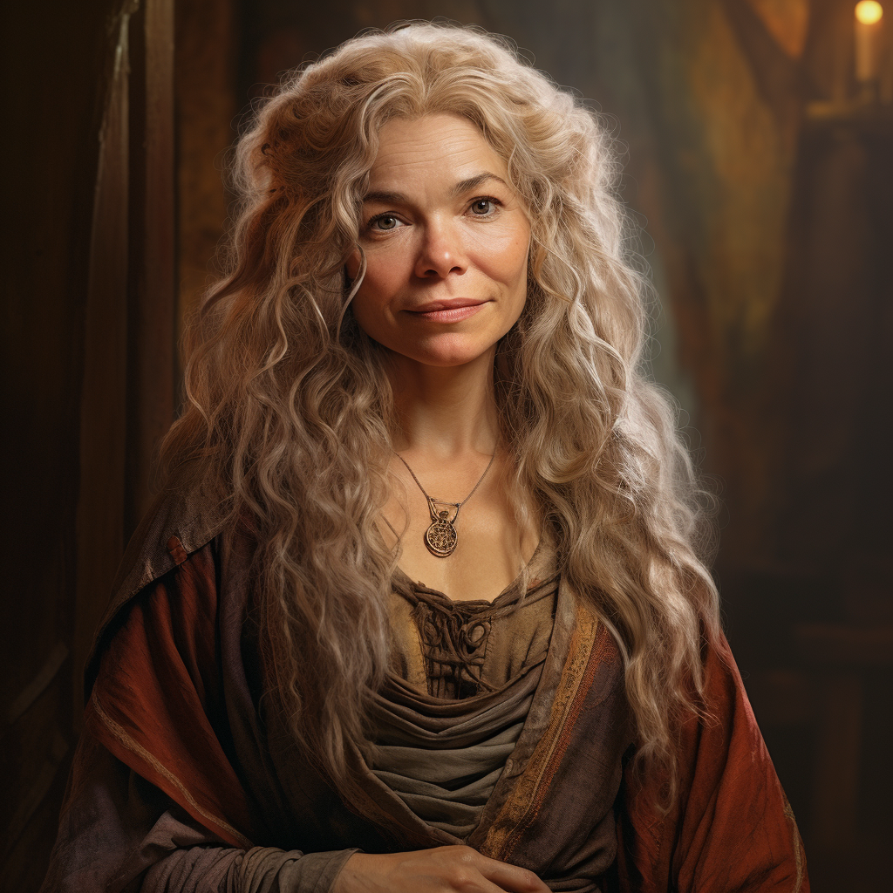

# Harriet Goodbarrel

- :octicons-info-24:{ .lg .middle } __Biographical Information__

    A [halfling](<../../species/halflings.md>) (she/her), of the [Goodbarrels](<../../groups/halfling-families/goodbarrels.md>)  
    Born DR 1685 (64 years old)  
    Proprietor of [The Singing Fox](<../../gazetteer/greater-sembara/tollen/the-singing-fox.md>)  
    { .bio }

    Originally from: the [Western Gulf](<../../gazetteer/greater-sembara/western-gulf.md>), the [Green Sea](<../../gazetteer/green-sea.md>)
    Based at [The Singing Fox](<../../gazetteer/greater-sembara/tollen/the-singing-fox.md>), in [Fairgate Outer](<../../gazetteer/greater-sembara/tollen/fairgate-outer.md>), the [Free City of Tollen](<../../gazetteer/greater-sembara/tollen/tollen.md>)

:octicons-location-24:{ .lg .middle } Met by [Wellby](<../pcs/dunmar-fellowship/wellby.md>) on DR 1730 at [The Singing Fox](<../../gazetteer/greater-sembara/tollen/the-singing-fox.md>), in [Fairgate Outer](<../../gazetteer/greater-sembara/tollen/fairgate-outer.md>), the [Free City of Tollen](<../../gazetteer/greater-sembara/tollen/tollen.md>)  

:octicons-location-24:{ .lg .middle } Met by the [Dunmar Fellowship](<../pcs/dunmar-fellowship/dunmar-fellowship.md>) on December 30th, 1748 [Vindristjarna](<../../things/ships/vindristjarna.md>)  

{align="right"; width="300"}

Harriet's melodious voice graces *[The Singing Fox](<../../gazetteer/greater-sembara/tollen/the-singing-fox.md>)* on performance nights, drawing an enthusiastic crowd of locals and passing halflings. Though initially reserved, she truly shines when on stage, and alongside her wife, [Chenna](<./chenna-goodbarrel.md>), she's made the tavern a warm haven for many.

Harriet married into the [Goodbarrel clan](<../../groups/halfling-families/goodbarrels.md>); while she never had her own children, she feels a matronly duty to all the scattered Goodbarrel youth. 
## Relationships
- [Chenna Goodbarrel](<./chenna-goodbarrel.md>), wife
- [Wellby](<../pcs/dunmar-fellowship/wellby.md>), a distant relation, something like a third cousin once removed by marriage

