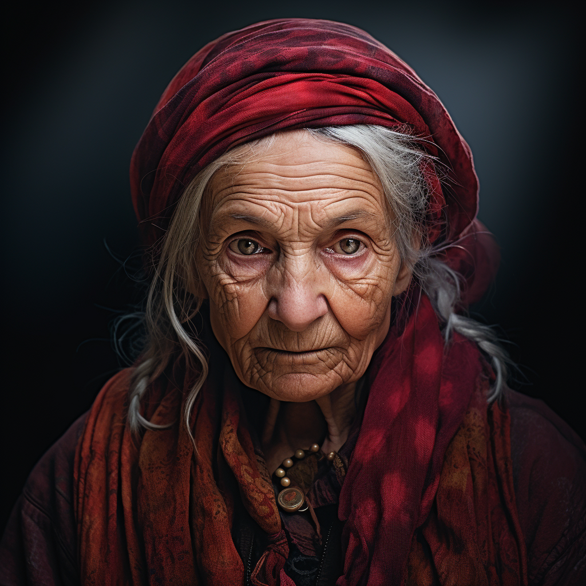

# Marigold Stonebridge

- :octicons-info-24:{ .lg .middle } __Biographical Information__

    A [Sembaran](<../../gazetteer/greater-sembara/sembara/sembara.md>) [halfling](<../../creatures/species/halflings.md>) (she/her), of the [Stonebridges](<../../groups/halfling-families/stonebridges.md>)  
    Born DR 1624 (126 years old)  
    Member of the [Lord's Council of Cleenseau](<../../gazetteer/greater-sembara/sembara/barony-of-aveil/cleenseau-region/cleenseau/lord-s-council-of-cleenseau.md>)  
    Proprietor of [The Crossroads Inn](<../../gazetteer/greater-sembara/sembara/barony-of-aveil/cleenseau-region/cleenseau/the-crossroads-inn.md>)  
    { .bio }

    Based in [Cleenseau](<../../gazetteer/greater-sembara/sembara/barony-of-aveil/cleenseau-region/cleenseau/cleenseau.md>), the [Manor of Cleenseau](<../../gazetteer/greater-sembara/sembara/barony-of-aveil/cleenseau-region/manor-of-cleenseau.md>), the [Barony of Aveil](<../../gazetteer/greater-sembara/sembara/barony-of-aveil/barony-of-aveil.md>)

{align="right"; width="320"}An old, wrinkled halfling, often quiet and sleepy, but with surprising wit. The most important of the three current inn keepers of [The Crossroads Inn](<../../gazetteer/greater-sembara/sembara/barony-of-aveil/cleenseau-region/cleenseau/the-crossroads-inn.md>) in [Cleenseau](<../../gazetteer/greater-sembara/sembara/barony-of-aveil/cleenseau-region/cleenseau/cleenseau.md>) along with [Venra Stonebridge](<./venra-stonebridge.md>) and [Willow Stonebridge](<./willow-stonebridge.md>). Often called Grandmother Marigold, she is considered the matriarch and wisest of the [Stonebridges](<../../groups/halfling-families/stonebridges.md>). 

She knows much of the history of The Crossroads Inn and is proud of its ancient heritage. 