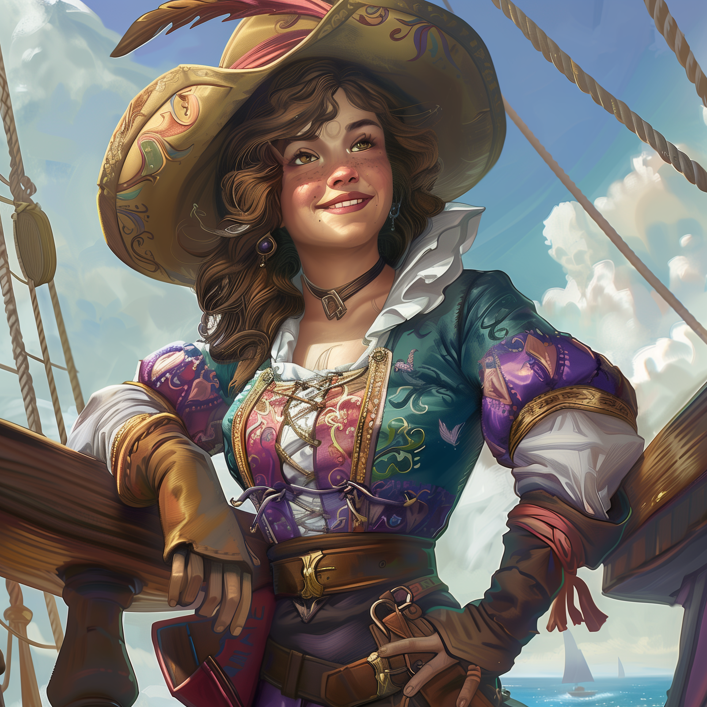

# Pippa Goodbarrow

- :octicons-info-24:{ .lg .middle } __Biographical Information__

    A [halfling](<../../species/halflings.md>) (she/her), of Goodbarrows  
    Captain of the [Summer's Breeze](<../../things/ships/summer-s-breeze.md>)  
    { .bio }

    Based in the [Summer's Breeze](<../../things/ships/summer-s-breeze.md>), the [Gulf of Chardon](<../../gazetteer/greater-chardon/gulf-of-chardon.md>), the [Endless Ocean](<../../gazetteer/endless-ocean.md>)

{align="right"; width="400"}Pippa is a cheerful halfling woman, with a warm, welcoming smile, often seen wearing a wide-brimmed hat. She has a love of good food, great ale, and great company, and attracts like-minded crew to her ship, the [Summer's Breeze](<../../things/ships/summer-s-breeze.md>). 

She has no fixed route or typical path, but is welcome is every port along the [Apporian Peninsula](<../../gazetteer/greater-chardon/chardonian-empire/apporia/apporia.md>) and the [~Emerald Coast~](<../../gazetteer/greater-chardon/emerald-coast.md>) for her genial nature, and her tendency to throw impromptu parties on deck. 

