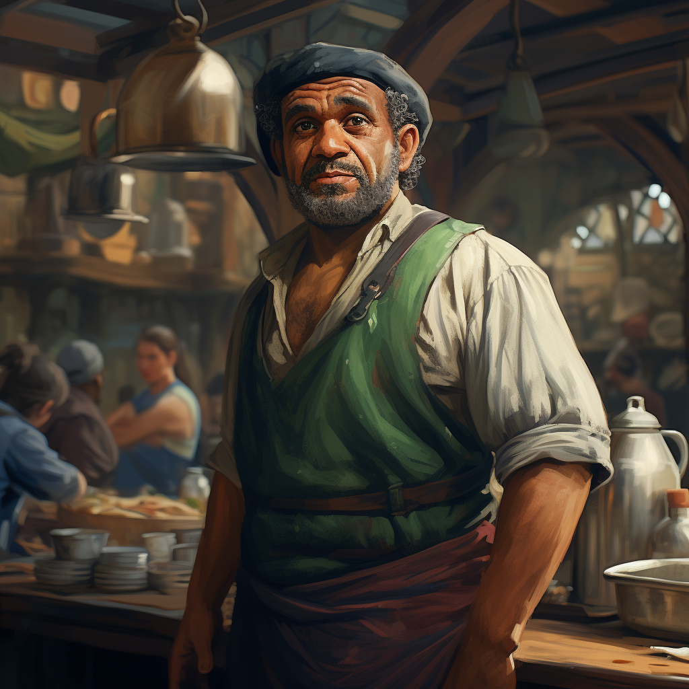

# Wendel Quickstep

- :octicons-info-24:{ .lg .middle } __Biographical Information__

    A [halfling](<../../species/halflings.md>) (he/him), of the [Quicksteps](<../../groups/halfling-families/quicksteps.md>)  
    Born DR 1671 (78 years old)  
    Proprietor of [The Windward Sail](<../../gazetteer/greater-sembara/tollen/the-windward-sail.md>) (since DR 1718)  
    { .bio }

    Originally from: Unknown
    Based in [The Windward Sail](<../../gazetteer/greater-sembara/tollen/the-windward-sail.md>), [Fiskurth](<../../gazetteer/greater-sembara/tollen/fiskurth.md>), the [Free City of Tollen](<../../gazetteer/greater-sembara/tollen/tollen.md>)

:octicons-location-24:{ .lg .middle } Met by [Wellby](<../pcs/dunmar-fellowship/wellby.md>) on DR 1738 in [The Windward Sail](<../../gazetteer/greater-sembara/tollen/the-windward-sail.md>), [Fiskurth](<../../gazetteer/greater-sembara/tollen/fiskurth.md>), the [Free City of Tollen](<../../gazetteer/greater-sembara/tollen/tollen.md>)  

:octicons-location-24:{ .lg .middle } Met by the [Dunmar Fellowship](<../pcs/dunmar-fellowship/dunmar-fellowship.md>) on December 16th, 1748 in [The Windward Sail](<../../gazetteer/greater-sembara/tollen/the-windward-sail.md>), [Fiskurth](<../../gazetteer/greater-sembara/tollen/fiskurth.md>), the [Free City of Tollen](<../../gazetteer/greater-sembara/tollen/tollen.md>)  

:octicons-location-24:{ .lg .middle } Last seen by the [Dunmar Fellowship](<../pcs/dunmar-fellowship/dunmar-fellowship.md>) on December 28th, 1748 in [The Windward Sail](<../../gazetteer/greater-sembara/tollen/the-windward-sail.md>), [Fiskurth](<../../gazetteer/greater-sembara/tollen/fiskurth.md>), the [Free City of Tollen](<../../gazetteer/greater-sembara/tollen/tollen.md>)  

Wendel is the long-time proprietor of *The Windward Sail*, a busy sailor's tavern in Fiskurth. Known as a place for tales and stories - some true, many not - and a place for gossip, as well as a place to find a crew. Has a few dirty, cramped rooms stacked with "human sized" bunks, and some slightly more comfortable halfling rooms. 
## Relationships
Wendel knows several regulars of [The Windward Sail](<../../gazetteer/greater-sembara/tollen/the-windward-sail.md>) well, including:
- [Wellby](<../pcs/dunmar-fellowship/wellby.md>), an old acquaintance who frequented The Windward Sail in his youth
- [Nika](<../tollenders/nika-hyne.md>), a collector of tales and legends, with connections to the [University of Tollen](<../../gazetteer/greater-sembara/tollen/university-of-tollen.md>)

