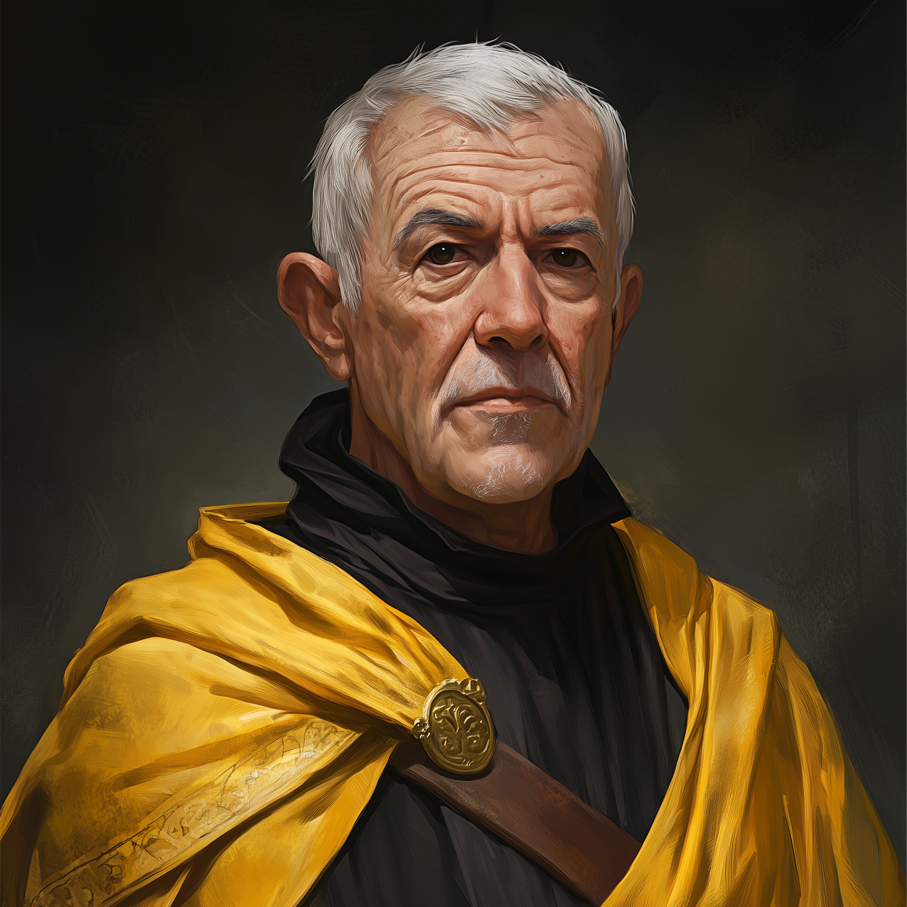

# Antonius Patrius

- :octicons-info-24:{ .lg .middle } __Biographical Information__

    A [Drankorian](<../../history/historical-realms/drankorian-empire.md>) [human](<../../creatures/species/humans.md>) (he/him)  
    b. DR 986 - d. DR 1051, died at age 65 years  
    Member of the [Radiant Path](<../../groups/drankorian-societies/radiant-path.md>) (until DR 1051)  
    { .bio }

    Lived in [Drankor](<../../gazetteer/drankorian-hinterland/drankor/drankor.md>)

{align="right"; width="300"}Antonius Patrius was a Drankorian temple administrator, dedicated to the Father, who was captured and killed by [Apollyon](<drankorian-emperors/apollyon.md>), his soul bound as part of the ritual to construct [Apollyon's Phylactery](<../../things/artifacts-of-power/apollyon-s-phylactery.md>). He vanished in DR 1051, captured by Apollyon's loyal servants on a stormy night as he was returning to the [Temple of the Eight Divines](<../../gazetteer/drankorian-hinterland/drankor/temple-of-the-eight-divines.md>) in [Drankor](<../../gazetteer/drankorian-hinterland/drankor/drankor.md>) after helping a group of halflings flee the city. His fate was unknown for many centuries, until the [Dunmar Fellowship](<../pcs/dunmar-fellowship/dunmar-fellowship.md>) ventured to [Drankor](<../../gazetteer/drankorian-hinterland/drankor/drankor.md>) to defeat [Apollyon](<drankorian-emperors/apollyon.md>). 

His story is recorded in the [Book of Martyrs of the Radiant Path](<../../things/books/book-of-martyrs-of-the-radiant-path.md>), a hidden record and memorial kept by the priests of the [Radiant Path](<../../groups/drankorian-societies/radiant-path.md>) of those disappeared and taken during Apollyon's reign. His story was retold by the [Dunmar Fellowship](<../pcs/dunmar-fellowship/dunmar-fellowship.md>), after they recovered the Book of Martyrs from [Drankor](<../../gazetteer/drankorian-hinterland/drankor/drankor.md>) and defeated [Apollyon](<drankorian-emperors/apollyon.md>). 

>[!quote]+ Excerpt from the Book of Martyrs
*The words of the memories of the [Radiant Path](<../../groups/drankorian-societies/radiant-path.md>), humbly set pen to parchment in the name of Mos Numena, that we might preserve the truth of Antonius Patrius: Born in the quieter days of our city, he embraced The Father's order with a reverence undiminished by his lack of divine gifts. Where others pursued miracles, Antonius labored in diplomacy and stewardship, bringing unity to the most disparate temples under the early reign of Apollyon. When the Emperor turned tyrant and banned the faithful from their rightful pilgrimages, Antonius worked in secret to shield the old ways, quietly guiding the nascent [Radiant Path](<../../groups/drankorian-societies/radiant-path.md>) through perilous times. As strife consumed the streets, his hands were never idle; he smuggled the persecuted beyond the city walls and offered solace to all who remained in Drankor’s shadow. I write these words with sorrow in my heart, recalling how he was taken by the [Ashen Cloaks](<../../groups/drankorian-societies/ashen-cloaks.md>) one storm-lashed eve, returning from his final act of mercy. May The Father’s light ever shine upon his name, and may we who follow remember the steadfast courage of Antonius Patrius.*

The full tale of his life is reported below: 

Antonius Patrius grew up in a quiet, reflective era under the reign of Akaston, when Drankor was still recovering from the chaos of civil war. Born to a merchant family in one of the quieter districts of the capital, Antonius was drawn early to the steady, ordered life of the Temple of the Eight Divines, particularly the teachings of The Father. Though he showed no aptitude for divine magic, Antonius’ keen mind and deep reverence for the gods made him an invaluable steward, skilled in diplomacy and the logistics of managing Drankor's largest and most influential temple. 

When Apollyon declared himself chief steward of the Eight Divines in 1030, Antonius’ faith wavered. By 1032, when pilgrimage was banned and "official rites" were imposed, he began working in secret with other disillusioned clergy to preserve the older traditions. He helped organize the nascent [Radiant Path](<../../groups/drankorian-societies/radiant-path.md>), a network of priests and lay followers who sought to resist Apollyon’s desecration of the faith, serving as a vital organizer. As tensions in the city escalated into The Strife, Antonius played a key role in smuggling out elves, halflings, and others who faced persecution. In his final years, he rarely left the temple for fear of his life.

Antonius was taken in Dr 1051, on a stormy night, as he returned from arranging the safe passage of a group of persecuted halflings. 