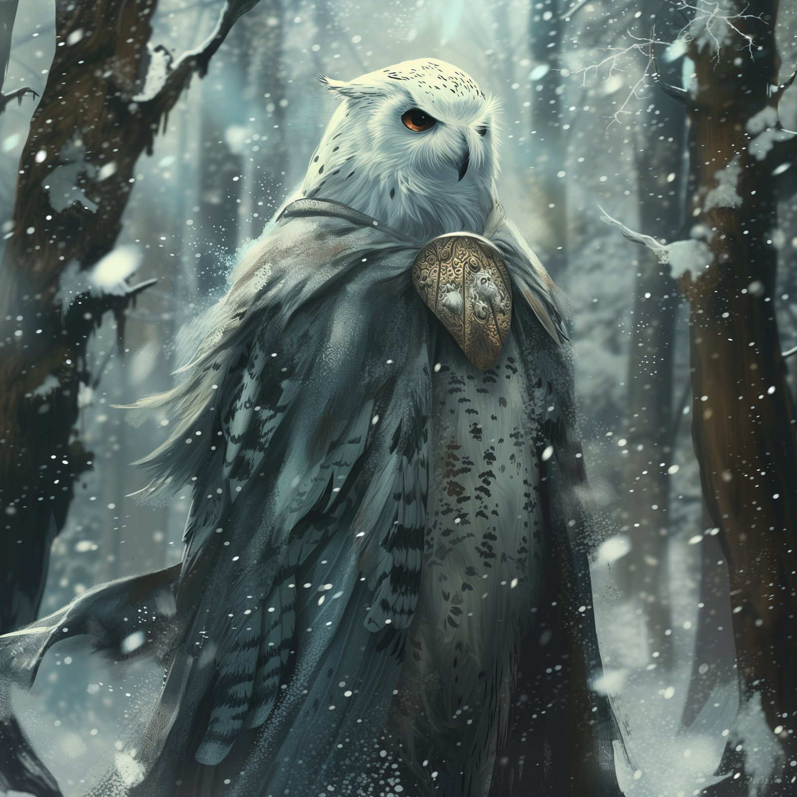

# Kecha

- :octicons-info-24:{ .lg .middle } __Biographical Information__

    A kenku (he/him)  
    { .bio }

    Based in the [Free City of Tollen](<../../gazetteer/western-green-sea/tollen/tollen.md>)

A young kenku scout. {align="right"; width="400"}

