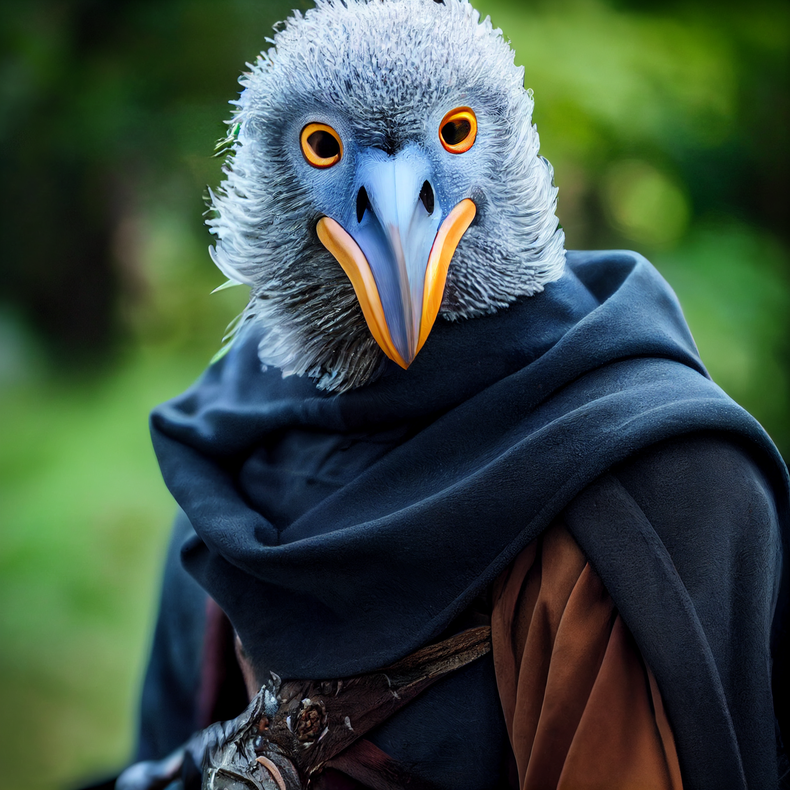

# Makha
:speaker:{ .middle } *(MAH-kah)*  

- :octicons-info-24:{ .lg .middle } __Biographical Information__

    An Islander [kenku](<../../species/unusual-species/kenku/kenku.md>) (he/him)  
    Born DR 1712 (37 years old)  
    { .bio }

    Based in [Wahacha](<../../gazetteer/eastern-green-sea/wahacha.md>), the [Vermillion Isles](<../../gazetteer/eastern-green-sea/vermillion-isles.md>), [~Eastern Islands~](<../../gazetteer/eastern-green-sea/eastern-islands.md>)

:octicons-location-24:{ .lg .middle } Met by [Wellby](<../pcs/dunmar-fellowship/wellby.md>) on October 12th, 1748 in [Wahacha](<../../gazetteer/eastern-green-sea/wahacha.md>), the [Vermillion Isles](<../../gazetteer/eastern-green-sea/vermillion-isles.md>), [~Eastern Islands~](<../../gazetteer/eastern-green-sea/eastern-islands.md>)  

The port master and unofficial town spokesperson for the kenku settlement of [Wahacha](<../../gazetteer/eastern-green-sea/wahacha.md>).  

{width="500"}

## Relationships:
Makha knows the people of Wahacha well, including:
- [Nahto](<./nahto.md>) and [Skoda](<./skoda.md>), a married couple, travelers and wanderers based out of Wahacha
- [Rufus](<../pcs/dunmar-fellowship/guests/rufus.md>), a monster hunter, who hunts down threats to the island in exchange for food and shelter from the islanders

