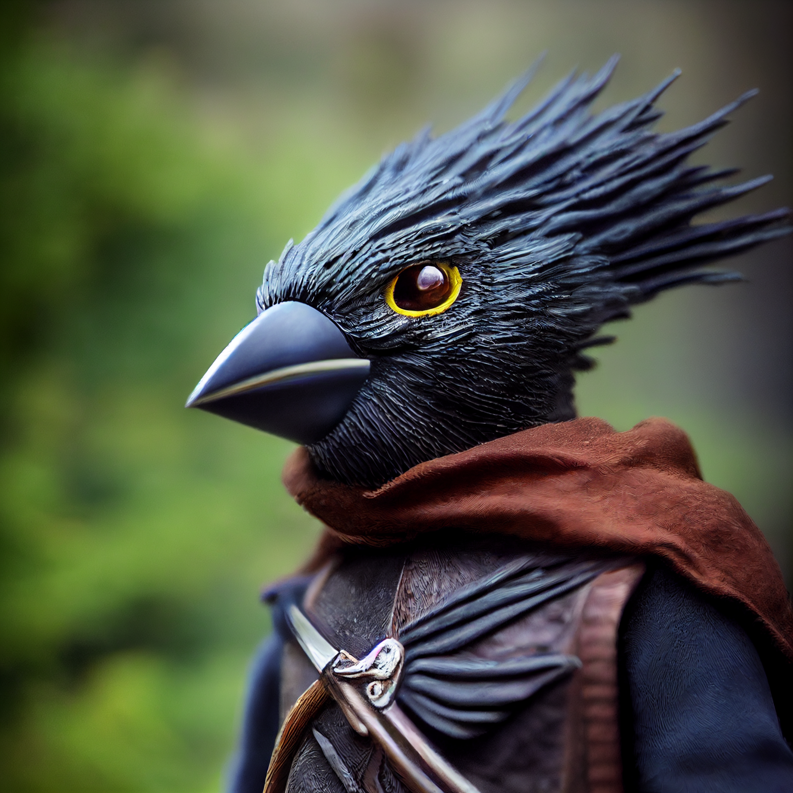

# Skoda

- :octicons-info-24:{ .lg .middle } __Biographical Information__

    An Islander kenku (she/her)  
    Born DR 1700 (49 years old)  
    { .bio }

    Based in [Wahacha](<../../gazetteer/eastern-green-sea/wahacha.md>), the [Vermillion Isles](<../../gazetteer/eastern-green-sea/vermillion-isles.md>), the ~Eastern Islands~

:octicons-location-24:{ .lg .middle } Last known location (as of October 16th, 1748): the [sea elf village in Quanyi](<../../gazetteer/eastern-green-sea/quanyi.md>), the ~Eastern Islands~, the [Green Sea](<../../gazetteer/green-sea.md>)

:octicons-location-24:{ .lg .middle } Rescued by [Wellby](<../pcs/dunmar-fellowship/wellby.md>) on October 14th, 1748 from the aboleth lair east of the [Vermillion Isles](<../../gazetteer/eastern-green-sea/vermillion-isles.md>), in the ~Eastern Islands~, the [Green Sea](<../../gazetteer/green-sea.md>)  

{align="right"; width="400"}A kenku woman in late middle age, who travels the islands of the [Eastern Green Sea](<../../gazetteer/eastern-green-sea/eastern-green-sea.md>) with her partner [Nahto](<./nahto.md>). She is fey-touched and has a hint of magic about her. 

In early October 1748, she was captured by a recently awakened aboleth and dragged to its undersea lair with [Nahto](<./nahto.md>). She was rescued, along with other captives, by [Wellby](<../pcs/dunmar-fellowship/wellby.md>) and his companions on October 14, 1748. However, she suffered from the aboleth's curse, and could no longer survive without frequently being immersed in water. After telling [Wellby](<../pcs/dunmar-fellowship/wellby.md>) of her friend [Arryn the Wanderer](<../other-humans/arryn.md>), a wizard living in the northern part of the islands who could aid him with magic to make his way to the [Feywild](<../../cosmology/multiverse/echo-realms/feywild/feywild.md>), she traveled with other victims of the aboleth to the sea elf village off the coast of [Quanyi](<../../gazetteer/eastern-green-sea/quanyi.md>), where she remains a guest until a cure for the aboleth's curse can be found. 
