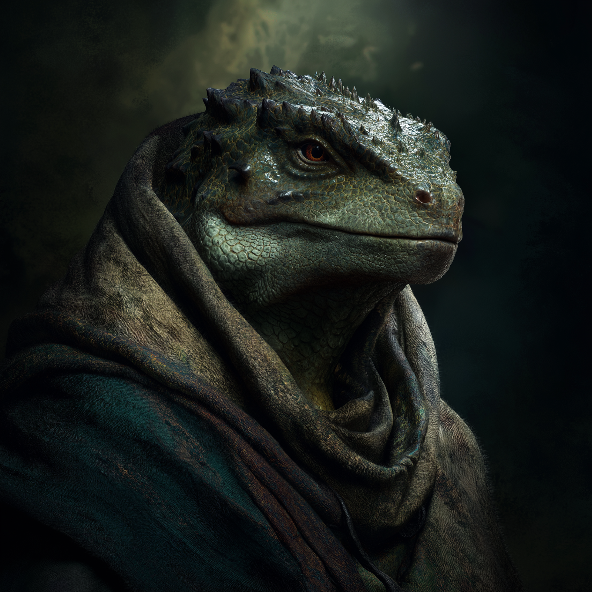

# Aritza
:speaker:{ .middle } *(ah-REET-sah)*  

- :octicons-info-24:{ .lg .middle } __Biographical Information__

    A [lizardfolk](<../../species/lizardfolk.md>) (he/him)  
    Born DR 1636 (113 years old)  
    { .bio }

    Based in the [Aursen Marshes](<../../gazetteer/upper-istaros/refounded-alliance-of-aurbez/aursen-marshes.md>), the [Refounded Alliance of Aurbez](<../../gazetteer/upper-istaros/refounded-alliance-of-aurbez/refounded-alliance-of-aurbez.md>)

:octicons-location-24:{ .lg .middle } Met by the [Dunmar Fellowship](<../pcs/dunmar-fellowship/dunmar-fellowship.md>) on August 7th, 1749 in [Three Wells](<../../gazetteer/upper-istaros/refounded-alliance-of-aurbez/three-wells.md>), the [Refounded Alliance of Aurbez](<../../gazetteer/upper-istaros/refounded-alliance-of-aurbez/refounded-alliance-of-aurbez.md>)  

{align="right"; width="400"}Aritza is a lizardfolk elder, representing the people of the marshes in [Refounded Alliance of Aurbez](<../../gazetteer/upper-istaros/refounded-alliance-of-aurbez/refounded-alliance-of-aurbez.md>) business. 

