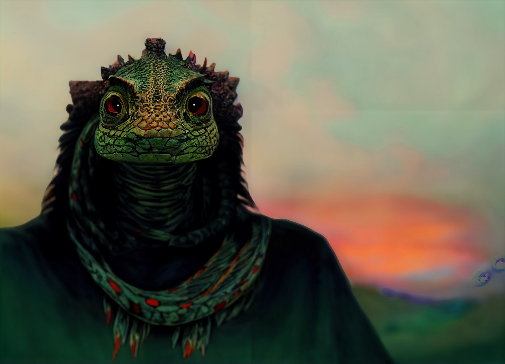

# Elazar

- :octicons-info-24:{ .lg .middle } __Biographical Information__

    A [lizardfolk](<../../species/children-of-the-embodied-gods/lizardfolk/lizardfolk.md>) (he/him)  
    Born DR 1665 (84 years old)  
    { .bio }

    Based in [Bedez](<../../gazetteer/far-south/bedez.md>), [Orekatu](<../../gazetteer/far-south/orekatu.md>), the South Region

:octicons-location-24:{ .lg .middle } Met by [Kenzo](<../pcs/dunmar-fellowship/kenzo.md>) on September 30th, 1748 in [Bedez](<../../gazetteer/far-south/bedez.md>), [Orekatu](<../../gazetteer/far-south/orekatu.md>), the South Region  

:octicons-location-24:{ .lg .middle } Last seen by [Kenzo](<../pcs/dunmar-fellowship/kenzo.md>) on November 4th, 1748 in [Bedez](<../../gazetteer/far-south/bedez.md>), [Orekatu](<../../gazetteer/far-south/orekatu.md>), the South Region  

{align="right"; width="400"}A lizardfolk man in the prime of his life, a prophet, seer, and spirit guide who has deeply felt visions and exceptional perception into the spirit realms. A bit of an outcast in his village, seen as someone who sees trouble in everything.

- 1748 DR. Elazar began to acquire a reputation as far-sighted and wise, after he warned of the troubles of the [Azta Lekua](<../../gazetteer/far-south/azta-lekua.md>). 
- Sep 30, 1748 DR. Elazar met [Kenzo](<../pcs/dunmar-fellowship/kenzo.md>) when [Kenzo](<../pcs/dunmar-fellowship/kenzo.md>) appeared in [Orekatu](<../../gazetteer/far-south/orekatu.md>). Taught [Kenzo](<../pcs/dunmar-fellowship/kenzo.md>) the lizardfolk language and introduced him to lizardfolk spiritual practices over the next month.

