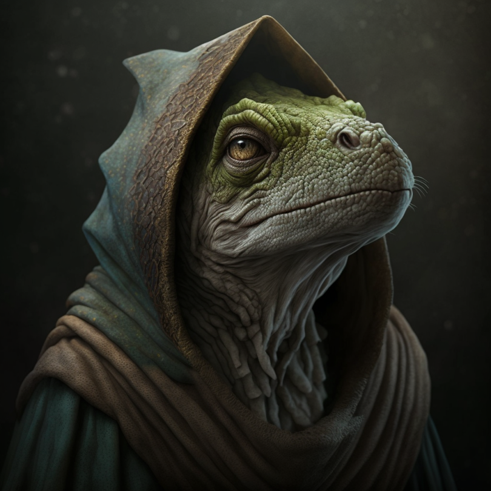

# Erdu

- :octicons-info-24:{ .lg .middle } __Biographical Information__

    { .bio }

{align="right"; width="320"}The spokesperson for the village of [Ganboa](<../../gazetteer/greater-sembara/sembara/barony-of-aveil/cleenseau-region/ganboa.md>) when dealing with humans. Older, with graying scales. Has a relatively low opinion of humans, all things considered. His family has lived along the Enst for hundreds of years (he says), and he is skeptical of [Sembaran](<../../gazetteer/greater-sembara/sembara/sembara.md>) claims to the land. 

