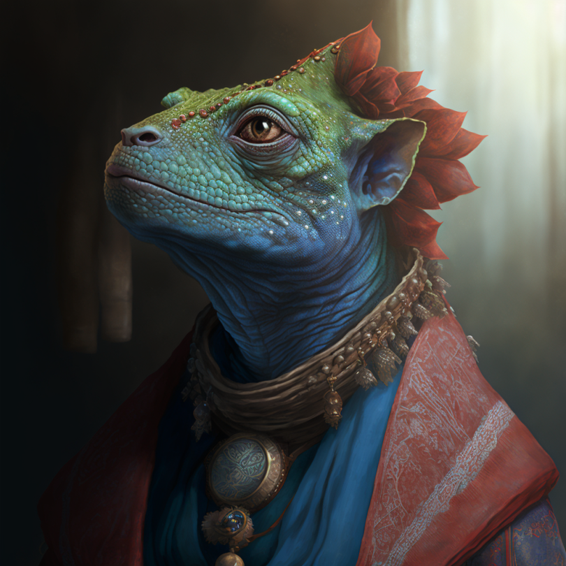

# Gentza

- :octicons-info-24:{ .lg .middle } __Biographical Information__

    A [lizardfolk](<../../species/children-of-the-embodied-gods/lizardfolk/lizardfolk.md>) (she/her)  
    b. DR 1681 - d. October 27th, 1719, murdered by bandits at age 38 years  
    { .bio }

    Lived in [Ganboa](<../../gazetteer/greater-sembara/sembara/barony-of-aveil/cleenseau-region/ganboa.md>), the [Barony of Aveil](<../../gazetteer/greater-sembara/sembara/barony-of-aveil/barony-of-aveil.md>), [Sembara](<../../gazetteer/greater-sembara/sembara/sembara.md>)

{align="right"; width="320"}An apprentice lizardfolk herbalist, said to be skilled at experimenting with remedies. She is a regular at the [Cleenseau](<../../gazetteer/greater-sembara/sembara/barony-of-aveil/cleenseau-region/cleenseau/cleenseau.md>) market where she sells herbal cures to humans, and is always interested in new maladies or remedies for them. She often sells to [Mermin Stonebridge](<../halflings/mermin-stonebridge.md>), a budding halfling merchant.

