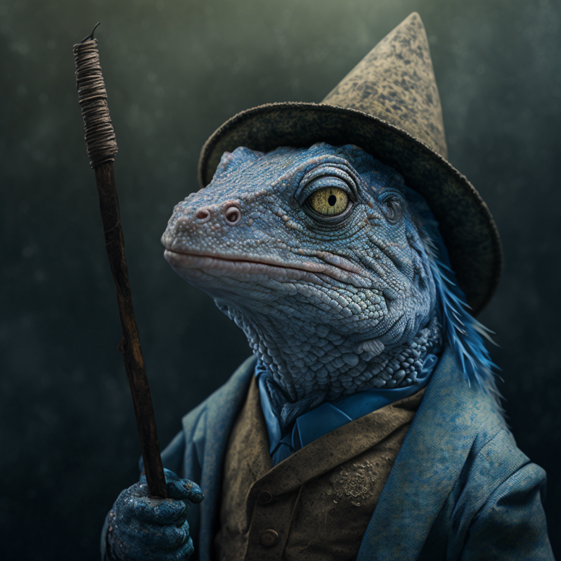

# Izoko

- :octicons-info-24:{ .lg .middle } __Biographical Information__

    A [lizardfolk](<../../species/children-of-the-embodied-gods/lizardfolk/lizardfolk.md>) (he/him)  
    Born DR 1688 (61 years old)  
    { .bio }

    Based in [Ganboa](<../../gazetteer/greater-sembara/sembara/barony-of-aveil/cleenseau-region/ganboa.md>), the [Barony of Aveil](<../../gazetteer/greater-sembara/sembara/barony-of-aveil/barony-of-aveil.md>), [Sembara](<../../gazetteer/greater-sembara/sembara/sembara.md>)

A young lizardfolk, sweet on [Gentza](<./gentza.md>).
