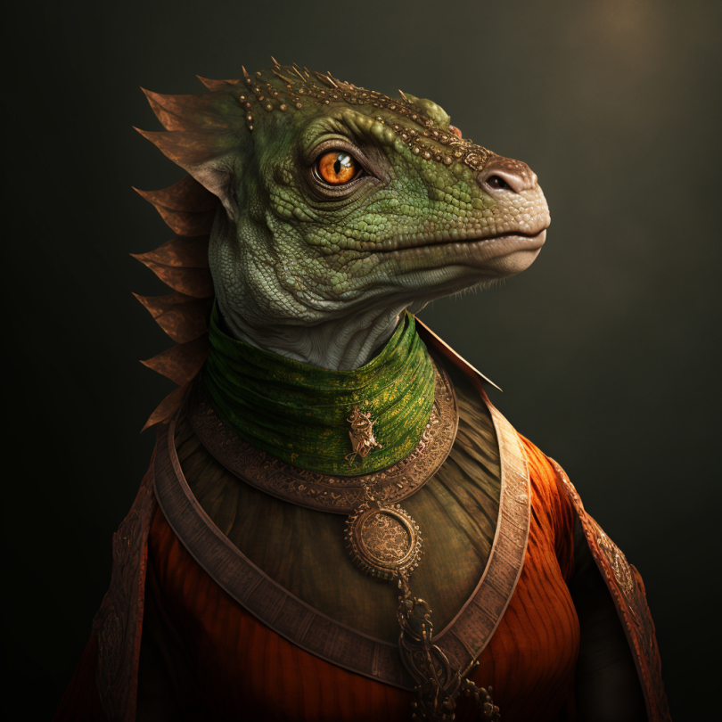

# Unai

- :octicons-info-24:{ .lg .middle } __Biographical Information__

    A [lizardfolk](<../../species/children-of-the-embodied-gods/lizardfolk/lizardfolk.md>) (she/her)  
    Born DR 1602 (147 years old)  
    { .bio }

    Based in [Ganboa](<../../gazetteer/greater-sembara/sembara/barony-of-aveil/cleenseau-region/ganboa.md>), the [Barony of Aveil](<../../gazetteer/greater-sembara/sembara/barony-of-aveil/barony-of-aveil.md>), [Sembara](<../../gazetteer/greater-sembara/sembara/sembara.md>)

{align="right"; width="320"}An herbalist and healer, teacher of [Gentza](<./gentza.md>). She is well-known in the region, but unlike her student, does not usually sell her remedies or bring them to human markets. 

