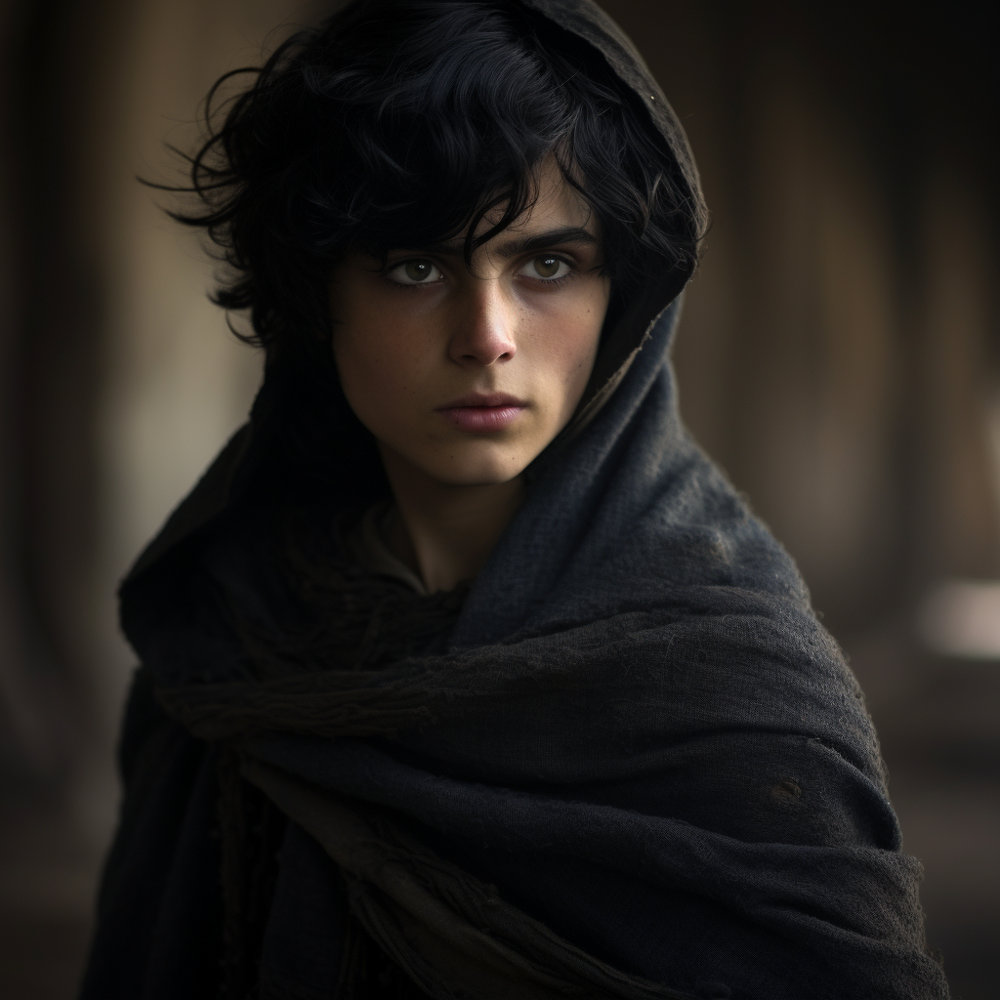

# Balthazar

- :octicons-info-24:{ .lg .middle } __Biographical Information__

    A [Maseaun](<../../gazetteer/greater-sembara/duchy-of-maseau/duchy-of-maseau.md>) [human](<../../species/humans/humans.md>) (he/him)  
    Born March 15th, 1705 (44 years old)  
    { .bio }

    Originally from: [Evis](<../../gazetteer/greater-sembara/duchy-of-maseau/evis.md>), the [Duchy of Maseau](<../../gazetteer/greater-sembara/duchy-of-maseau/duchy-of-maseau.md>)
    Based in [Cleenseau](<../../gazetteer/greater-sembara/sembara/barony-of-aveil/cleenseau-region/cleenseau/cleenseau.md>), the [Manor of Cleenseau](<../../gazetteer/greater-sembara/sembara/barony-of-aveil/cleenseau-region/manor-of-cleenseau.md>), the [Barony of Aveil](<../../gazetteer/greater-sembara/sembara/barony-of-aveil/barony-of-aveil.md>)

{align="right"; width="320"}He possesses a bright intellect but appears malnourished, bearing the marks of recent captivity by orcs. He is often shy, and seems to prefer to avoid crowds or a lot of people, but is keenly interested in learning and gaining knowledge. He is somewhat prideful, and hates to be given answers, and is often quite reluctant to accept help. He currently lives in Underhill with a number of other refugees from [Wakog's Camp](<../../gazetteer/greater-sembara/duchy-of-maseau/wakog-s-camp.md>), and has mostly been eking out a living on charity. 

