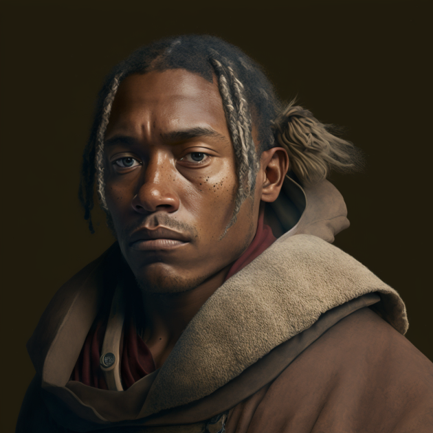

# Guy de Varan

- :octicons-info-24:{ .lg .middle } __Biographical Information__

    A [Sembaran](<../../gazetteer/greater-sembara/sembara/sembara.md>) [human](<../../species/children-of-divine-creation/humans/humans.md>) (he/him)  
    Born DR 1693 (56 years old)  
    { .bio }

    Based in [Evis](<../../gazetteer/greater-sembara/duchy-of-maseau/evis.md>), the [Duchy of Maseau](<../../gazetteer/greater-sembara/duchy-of-maseau/duchy-of-maseau.md>)

{align="right"; width="320"}A traveler and caravan expediter, he is relatively well-known along [Bandit's Way](<../../gazetteer/greater-sembara/roads/bandit-s-way.md>) as a man who can help find guards and organize supplies. The de Varan family is well-known in [Maseau](<../../gazetteer/greater-sembara/duchy-of-maseau/duchy-of-maseau.md>) and was originally from far southern [Isingue](<../../gazetteer/istaros-watershed/isingue.md>) before the Great War. 

He was captured by [Wakog](<../other-nonhumans/wakog.md>) in the late fall of 1720, and his escape to [Cleenseau](<../../gazetteer/greater-sembara/sembara/barony-of-aveil/cleenseau-region/cleenseau/cleenseau.md>) was the trigger that lead to the [Battle Against Wakog](<../../events/1700s/1719/12/battle-against-wakog.md>) and [Wakog's](<../other-nonhumans/wakog.md>) defeat.

