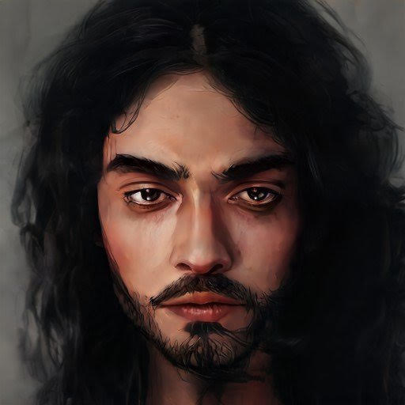

# Abelard

- :octicons-info-24:{ .lg .middle } __Biographical Information__

    A Mawaran [human](<../../species/humans.md>) (he/him)  
    { .bio }

    Originally from: the [Chardonian Empire](<../../gazetteer/greater-chardon/chardonian-empire/chardonian-empire.md>)
    Based in [Hamri](<../../gazetteer/northwest-coast/mawar-confederacy/hamri.md>), the [Mawar Confederacy](<../../gazetteer/northwest-coast/mawar-confederacy/mawar-confederacy.md>), the [Mawakel Peninsula](<../../gazetteer/northwest-coast/mawar-confederacy/mawakel-peninsula.md>)

A storyteller and performer who hangs around the [Leviathan Inn](<../../gazetteer/northwest-coast/mawar-confederacy/leviathan-inn.md>) telling wild tales mostly (so [Wazir](<../pcs/mawar-confederacy/wazir.md>) believes) made up. He disappears now and then for a month or a few weeks, and no one really knows where he goes. He is noticeably without visible means of support, but always seems to have coin to pay his tab on time. He is charming and open, but always seems to talk a lot without really answering anyone's questions about his background. He's been hanging around [Hamri](<../../gazetteer/northwest-coast/mawar-confederacy/hamri.md>) for ten years or so though. Originally from a small town in the Chardon hinterland. He is wickedly funny, and has a very strong singing voice.

