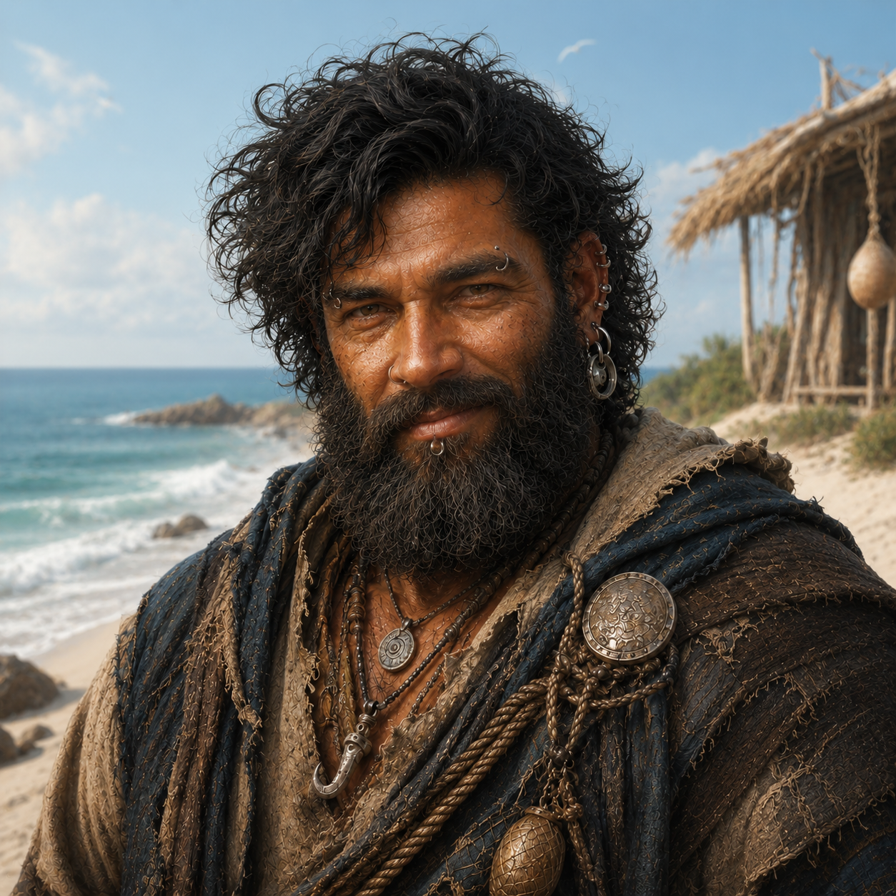

# Orden

- :octicons-info-24:{ .lg .middle } __Biographical Information__

    A [Mawaran](<../../gazetteer/northwest-coast/mawar-confederacy/mawar-confederacy.md>) [human](<../../creatures/species/humans.md>) (he/him)  
    { .bio }

    Based in [Hamri](<../../gazetteer/northwest-coast/mawar-confederacy/hamri.md>), the [Mawar Confederacy](<../../gazetteer/northwest-coast/mawar-confederacy/mawar-confederacy.md>), the [Mawakel Peninsula](<../../gazetteer/northwest-coast/mawar-confederacy/mawakel-peninsula.md>)

    A [Mawaran](<../../gazetteer/northwest-coast/mawar-confederacy/mawar-confederacy.md>) [human](<../../creatures/species/humans.md>) (he/him)  
    { .bio }

    Based in [Hamri](<../../gazetteer/northwest-coast/mawar-confederacy/hamri.md>), the [Mawar Confederacy](<../../gazetteer/northwest-coast/mawar-confederacy/mawar-confederacy.md>), the [Mawakel Peninsula](<../../gazetteer/northwest-coast/mawar-confederacy/mawakel-peninsula.md>)

{align="right"; width="300"}
Orden is a beach-dwelling Mawaran who lives in a shack north of the main port of [Hamri](<../../gazetteer/northwest-coast/mawar-confederacy/hamri.md>). He was born into a prominent local family, but now lives as an outcast, making do with salvage, fishing, scavenging, and whatever work the shore provides. He is short and stocky, with great bushy hair, a bushy beard, many piercings, and proud eyes.

Orden is a friend of [Trok](<../pcs/mawar/trok.md>). They sometimes work salvage together, and sometimes smoke [gatza](<../../things/materials/gatza.md>) on the beach late at night, each seeking their own solace. 

He is also [Hiyasa](<./hiyasa.md>)'s father. When [Hiyasa](<./hiyasa.md>) returned to [Hamri](<../../gazetteer/northwest-coast/mawar-confederacy/hamri.md>) after roughly ten years away and then vanished while treasure hunting up the Mirmir, Orden went to [Trok](<../pcs/mawar/trok.md>) for help. His request sent [Trok](<../pcs/mawar/trok.md>), [Nerissa](<../pcs/mawar/nerissa.md>), [Kaleho](<../pcs/mawar/kaleho.md>), and [Ryu](<../pcs/mawar/ryu.md>) after her, leading them to the [tomb of Yerkir-khor](<../../gazetteer/northwest-coast/mawar-confederacy/tomb-of-yerkir-khor.md>) and[her eventual rescue](<../../campaigns/mawar-adventures/episodes/mawar-adventures-episode-03.md>). 

