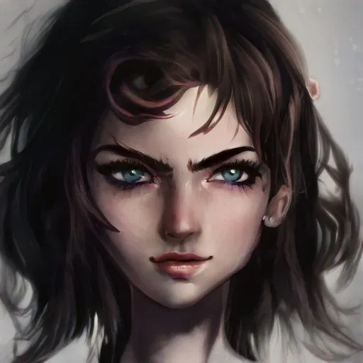

# Samar

- :octicons-info-24:{ .lg .middle } __Biographical Information__

    A Mawaran [human](<../../species/humans.md>) (she/her)  
    { .bio }

    Based in [Hamri](<../../gazetteer/northwest-coast/mawar-confederacy/hamri.md>), the [Mawar Confederacy](<../../gazetteer/northwest-coast/mawar-confederacy/mawar-confederacy.md>), the [Mawakel Peninsula](<../../gazetteer/northwest-coast/mawar-confederacy/mawakel-peninsula.md>)

The twin sister of [Reliah](<./reliah.md>), an orphaned girl who lives in the Drowned Flats. [Wazir](<../pcs/mawar-confederacy/wazir.md>) feeds her and her sister once a week, and in turn they keep an ear to the ground for him.

