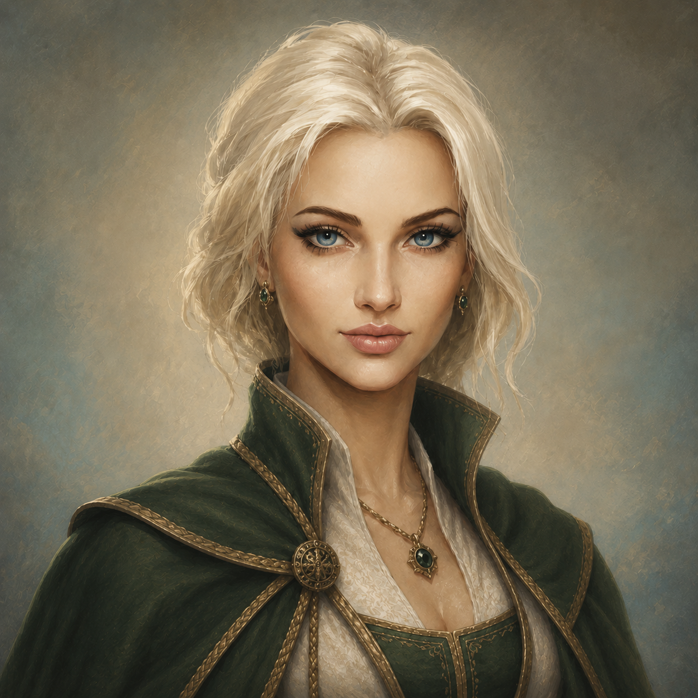

# Sulfi Mahadra

- :octicons-info-24:{ .lg .middle } __Biographical Information__

    A [Mawaran](<../../gazetteer/northwest-coast/mawar-confederacy/mawar-confederacy.md>) [human](<../../creatures/species/humans.md>) (she/her)  
    { .bio }

    Based in [Hamri](<../../gazetteer/northwest-coast/mawar-confederacy/hamri.md>), the [Mawar Confederacy](<../../gazetteer/northwest-coast/mawar-confederacy/mawar-confederacy.md>), the [Mawakel Peninsula](<../../gazetteer/northwest-coast/mawar-confederacy/mawakel-peninsula.md>)

    A [Mawaran](<../../gazetteer/northwest-coast/mawar-confederacy/mawar-confederacy.md>) [human](<../../creatures/species/humans.md>) (she/her)  
    { .bio }

    Based in [Hamri](<../../gazetteer/northwest-coast/mawar-confederacy/hamri.md>), the [Mawar Confederacy](<../../gazetteer/northwest-coast/mawar-confederacy/mawar-confederacy.md>), the [Mawakel Peninsula](<../../gazetteer/northwest-coast/mawar-confederacy/mawakel-peninsula.md>)

{align="right"; width="300"}Sulfi Mahadra, known as the Queen of Ships, lives with her partner Iesha on in a substantial house on Glittercliff. She owns a large fraction of the fishing fleet of [Hamri](<../../gazetteer/northwest-coast/mawar-confederacy/hamri.md>), and is the most important boat builder in the region. She inherited and greatly expanded the family business, and has been a fixture in Hamri for many decades. 

In addition to her ships, she owns the North Dock, and controls a tollhouse (known as Sulfi's Tollhouse) there. She pays for guards that collect rents and walk the dock at night, making a good profit from tie ups here.
