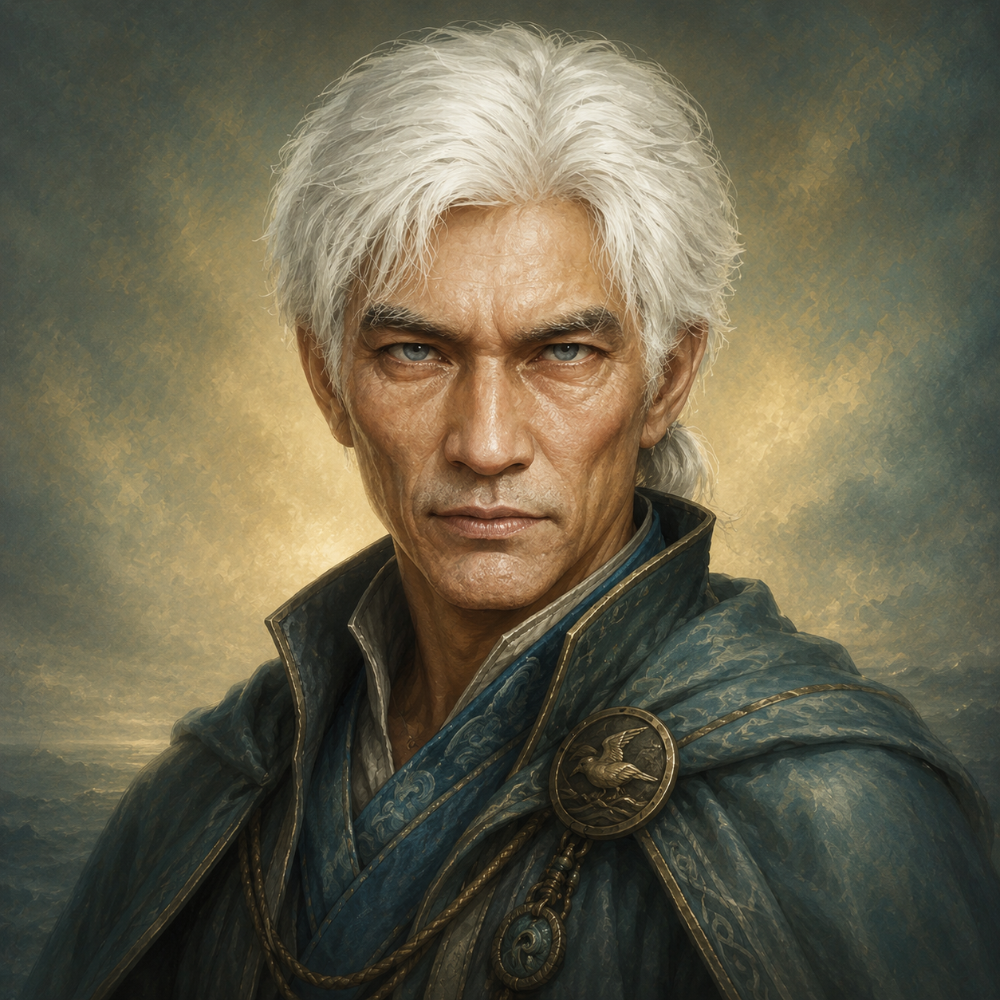

# Yaz

- :octicons-info-24:{ .lg .middle } __Biographical Information__

    A [Mawaran](<../../gazetteer/northwest-coast/mawar-confederacy/mawar-confederacy.md>) [human](<../../creatures/species/humans.md>) (he/him)  
    { .bio }

    Based in [Hamri](<../../gazetteer/northwest-coast/mawar-confederacy/hamri.md>), the [Mawar Confederacy](<../../gazetteer/northwest-coast/mawar-confederacy/mawar-confederacy.md>), the [Mawakel Peninsula](<../../gazetteer/northwest-coast/mawar-confederacy/mawakel-peninsula.md>)

:octicons-location-24:{ .lg .middle } Scryed by [Delwath](<../pcs/dunmar-fellowship/delwath.md>) on February 5th, 1749 in [Hamri](<../../gazetteer/northwest-coast/mawar-confederacy/hamri.md>), the [Mawar Confederacy](<../../gazetteer/northwest-coast/mawar-confederacy/mawar-confederacy.md>), the [Mawakel Peninsula](<../../gazetteer/northwest-coast/mawar-confederacy/mawakel-peninsula.md>)  

{align="right"; width="300"}Yaz is an elderly Mawaran ocean watcher who lives alone in an isolated tower above [Hamri](<../../gazetteer/northwest-coast/mawar-confederacy/hamri.md>). He has short white hair pulled back in a ponytail and is known for his intense attention to the moods, mysteries, and old lore of the western ocean.

Yaz preserves fragments of lore about the [Sentient Ocean](<../extraplanar-powers/sentient-ocean.md>) and its many names. The names he knows include [Yi'weti](<../extraplanar-powers/sentient-ocean.md>), the old mages' name for living ocean water; Ur Biyiak, used by lizardfolk sages for the living spirit of water heard in dreams; Wanui Teora, used by the great beasts of the deep and tied to the ocean's songs; and Ma'haya Kabir, associated with [Guzo the Mariner](<../../gods-and-religions/gods/incorporeal-gods/mawaran-saints/guzo-the-mariner.md>), the ancestor of voyages and the western horizon. Like many of the older generation of ocean watchers, Yaz believes that beasts who spend time in the waters of the [Sentient Ocean](<../extraplanar-powers/sentient-ocean.md>) may awaken to consciousness.

In early February DR 1749, [Delwath](<../pcs/dunmar-fellowship/delwath.md>) scried [Kaeso](<../chardonians/kaeso.md>) sitting quietly with [Yaz](<yaz.md>) on top of a tower overlooking the ocean, watching a storm crash against the cliffs. The vision showed Kaeso at peace.

