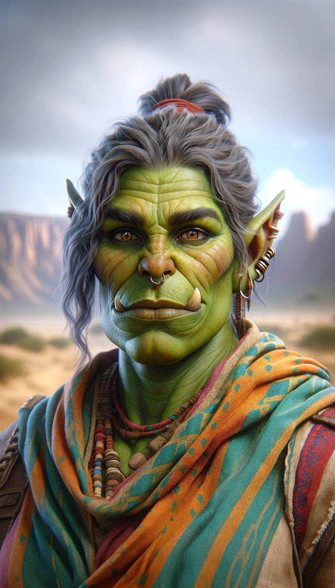

# Aygul
:speaker:{ .middle } *(EYE-gool)*  

- :octicons-info-24:{ .lg .middle } __Biographical Information__

    An [orc](<../../species/orcs.md>) (she/her)  
    Born DR 1698 (51 years old)  
    { .bio }

    Originally from: Gorzum
    Based in [Uzgukhar](<../../gazetteer/upper-istaros/xurkhaz/uzgukhar.md>), [Xurkhaz](<../../gazetteer/upper-istaros/xurkhaz/xurkhaz.md>), the [Garamjala Desert](<../../gazetteer/drankorian-hinterland/garamjala-plateau/garamjala-desert.md>)

:octicons-location-24:{ .lg .middle } Currently on [Vindristjarna](<../../things/ships/vindristjarna.md>), in the [Gulf of Chardon](<../../gazetteer/greater-chardon/gulf-of-chardon.md>), the [Endless Ocean](<../../gazetteer/endless-ocean.md>)

{align="right"; width="320"}An orc brawler and fighter, who sees herself as a defender of her people and especially her twin sister, [Nuzkar](<./nuzkar.md>). A loner, with no other family.

