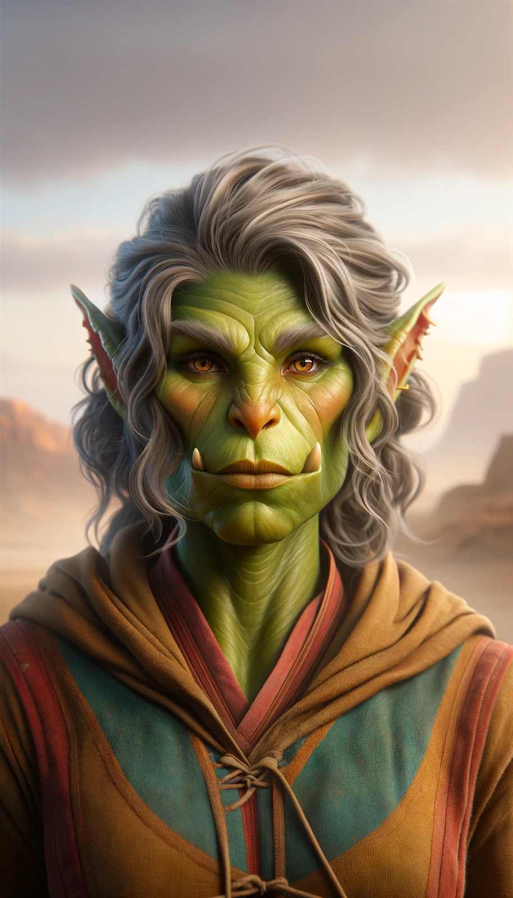

# Nuzkar
*(NUZ-car)*
>[!info]+ Biographical Info
> An [orc](<../../species/children-of-the-embodied-gods/orcs/orcs.md>) (she/her)
> 
>> 

An orc scholar, loremaster, and archivist, seeking stories, rumors, and information about other free orcs, about how Thark's enslavement works, and how to free more of her people. 

She has a twin sister, [Aygul](<./aygul.md>), as well as a husband and large family in Uzgukhar. 

Inspired by [Riswynn](<../pcs/dunmar-fellowship/riswynn.md>) and the [Battle for Uzgukhar](<../../events/1700s/1749/battle-for-uzgukhar.md>) to rededicate herself to her childhood dream of doing more for all orcs who suffer, unfree, in Thark's control. 

