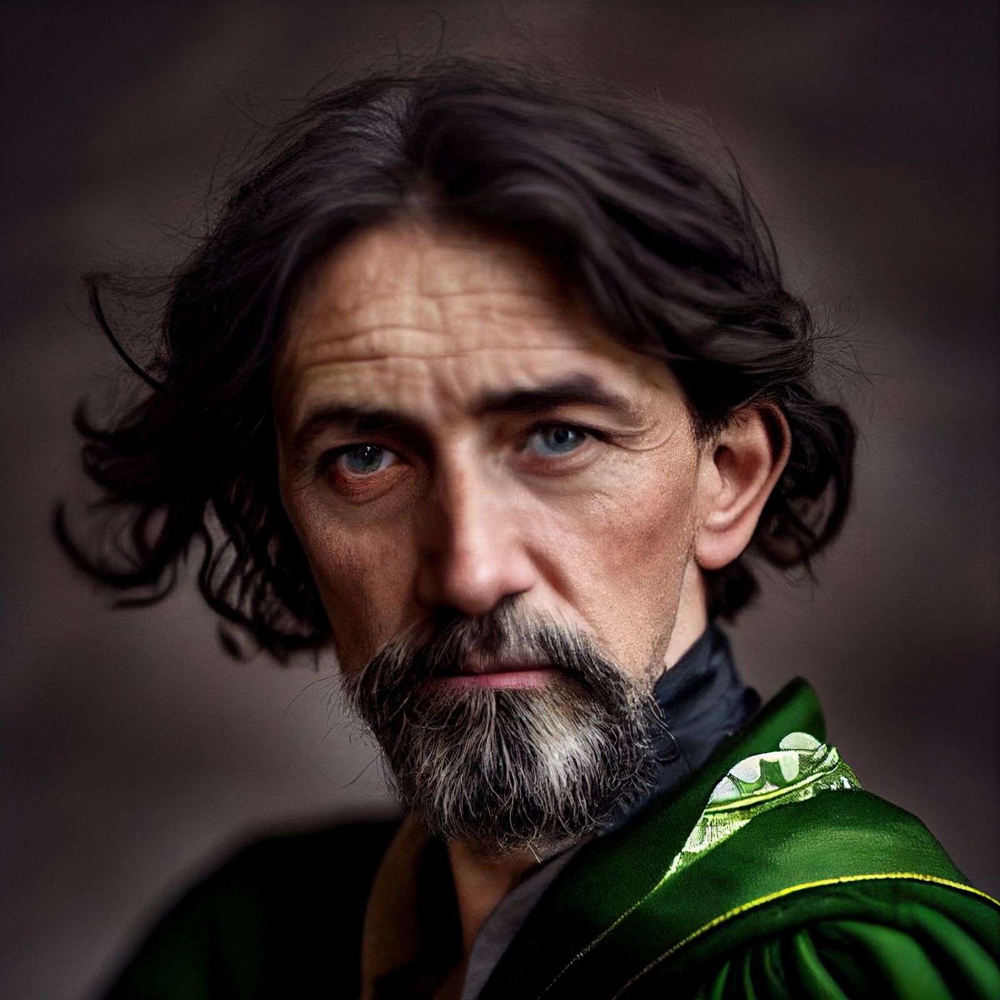

# Arryn

- :octicons-info-24:{ .lg .middle } __Biographical Information__

    A [Tollender](<../../gazetteer/western-green-sea/tollen/tollen.md>) [human](<../../species/humans/humans.md>) (he/him)  
    { .bio }

    Originally from: the [Free City of Tollen](<../../gazetteer/western-green-sea/tollen/tollen.md>)

:octicons-location-24:{ .lg .middle } Currently in the [Eastern Green Sea](<../../gazetteer/eastern-green-sea/eastern-green-sea.md>), the [Green Sea](<../../gazetteer/green-sea.md>)

:octicons-location-24:{ .lg .middle } The rescued from the [Mirror Realm](<../../cosmology/multiverse/echo-realms/mirror-realm.md>) by [Wellby](<../pcs/dunmar-fellowship/wellby.md>) on November 13th, 1748 in the [Eastern Green Sea](<../../gazetteer/eastern-green-sea/eastern-green-sea.md>), the [Green Sea](<../../gazetteer/green-sea.md>)  

{align="right"; width="400"}A wizard of significant power. Originally from [Tollen](<../../gazetteer/western-green-sea/tollen/tollen.md>), but now dwells in a tower in the northern part of the ~Eastern Islands~. Fascinated by other dimensions, recently the hypothesized [Mirror Realm](<../../cosmology/multiverse/echo-realms/mirror-realm.md>) in particular. 

In the fall of 1748, vanished into the [Mirror Realm](<../../cosmology/multiverse/echo-realms/mirror-realm.md>) after an experiment went wrong. Arryn was later freed by [Wellby](<../pcs/dunmar-fellowship/wellby.md>), [Alimash](<../pcs/dunmar-fellowship/guests/alimash.md>), and [Shoal](<../pcs/dunmar-fellowship/guests/shoal.md>) during [Wellby's adventures in the eastern Green Sea](<../../campaigns/dunmari-frontier/session-notes/session-60-dufr.md>). After his rescue, he sent Wellby to the Feywild to reunite with the [Dunmar Fellowship](<../pcs/dunmar-fellowship/dunmar-fellowship.md>); [Alimash](<../pcs/dunmar-fellowship/guests/alimash.md>) joined Arryn's service.

