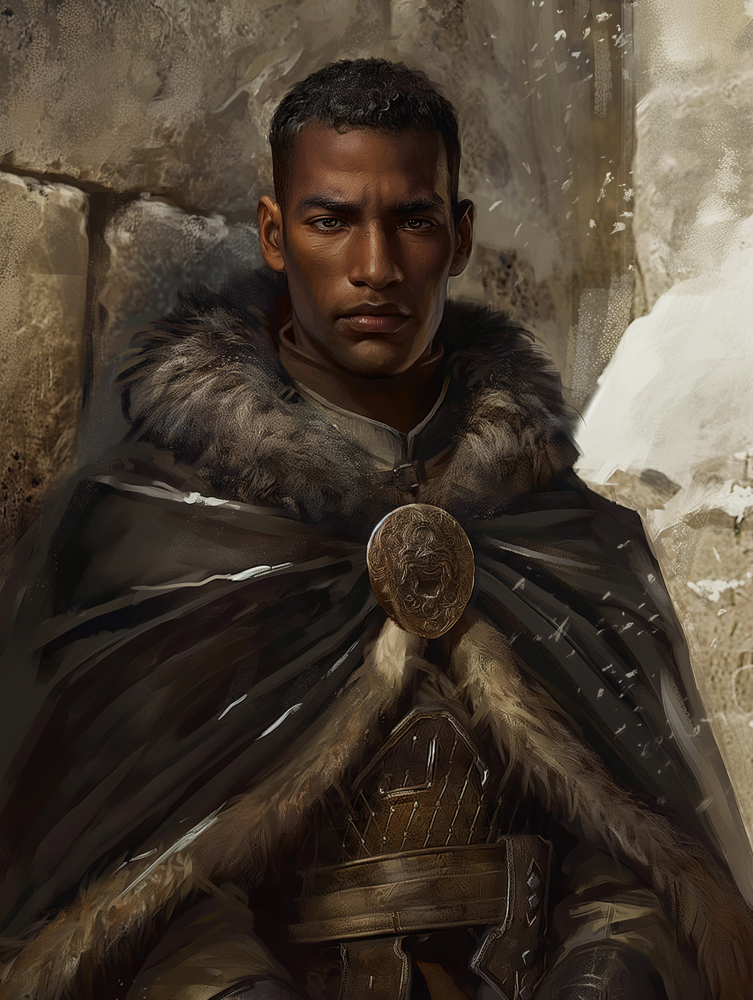

# Branek Mirov

- :octicons-info-24:{ .lg .middle } __Biographical Information__

    A [human](<../../species/humans/humans.md>) (he/him)  
    Born DR 1697 (52 years old)  
    Member of the [Rodnya Voknaz](<../../groups/urskan-magical-organizations/rodnya-voknaz.md>)  
    { .bio }

    Based in the Voknaz Manor, [Ursk](<../../gazetteer/northern-green-sea/ursk.md>), the Northern Green Sea

{align="right"; width="400"}Branek is a powerful wizard and high-ranking member of the Rodnya Voknaz, based at the Voknaz Manor, the headquarters of the rodnya. 

He is devoted to the [Rodnya Voknaz](<../../groups/urskan-magical-organizations/rodnya-voknaz.md>), and has dedicated his life to the organization. 

