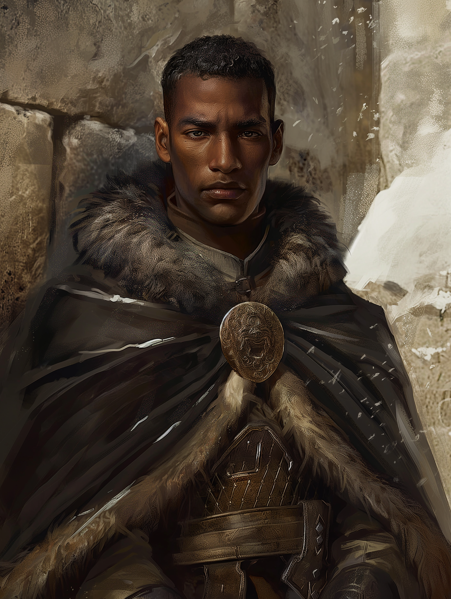

# Branek Mirov

- :octicons-info-24:{ .lg .middle } __Biographical Information__

    An [Urskan](<../../gazetteer/northern-green-sea/ursk/ursk.md>) [human](<../../creatures/species/humans.md>) (he/him)  
    Born DR 1697 (53 years old)  
    Member of [Rodnya Voknaz](<../../groups/urskan-magical-organizations/rodnya-voknaz.md>)  
    { .bio }

    Based in the [Voknaz Manor](<../../gazetteer/northern-green-sea/ursk/voknaz-manor.md>), [Ursk](<../../gazetteer/northern-green-sea/ursk/ursk.md>)

{align="right"; width="400"}Branek is a powerful wizard and high-ranking member of the [Rodnya Voknaz](<../../groups/urskan-magical-organizations/rodnya-voknaz.md>), based at the Voknaz Manor, the headquarters of the rodnya. 

He is devoted to the [Rodnya Voknaz](<../../groups/urskan-magical-organizations/rodnya-voknaz.md>), and has dedicated his life to the organization. 

