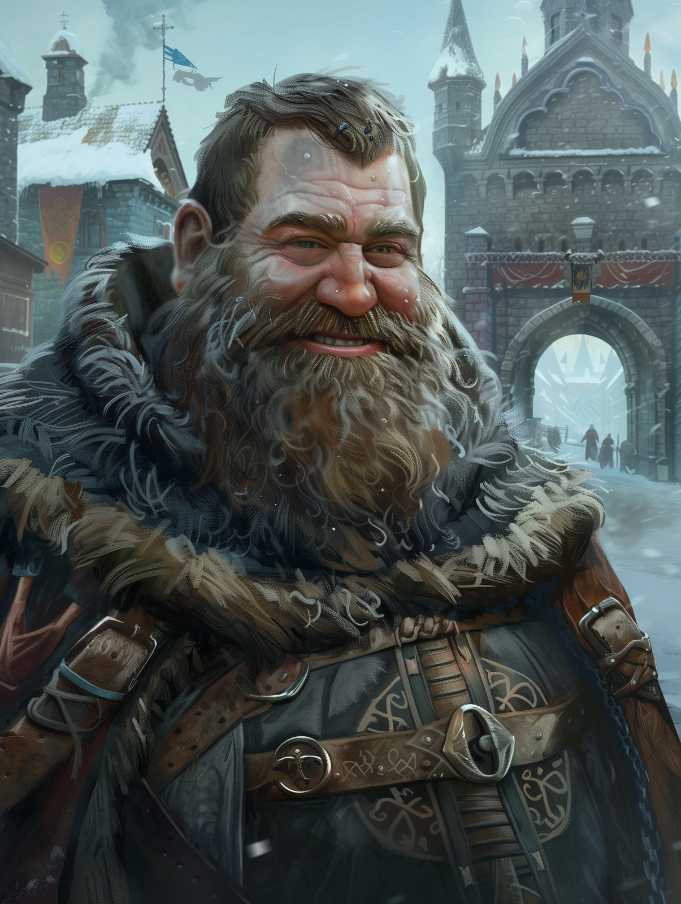

# Fyodar

- :octicons-info-24:{ .lg .middle } __Biographical Information__

    An [Urskan](<../../gazetteer/northern-green-sea/ursk/ursk.md>) [human](<../../species/humans.md>) (he/him)  
    { .bio }

    Based in [Zvervinka](<../../gazetteer/northern-green-sea/ursk/zvervinka.md>), [Ursk](<../../gazetteer/northern-green-sea/ursk/ursk.md>)

{align="right"; width="400"}Fyodar is a large, burly man with a thick beard and a ready smile. He is a member of the Zvervinkan Guard, tasked with guarding the city gates and approving the entry of visitors and travelers coming to trade in Zvervinka's markets. 

He is well-connected among the city merchants and often has useful tips on where and what to buy, or sell. 