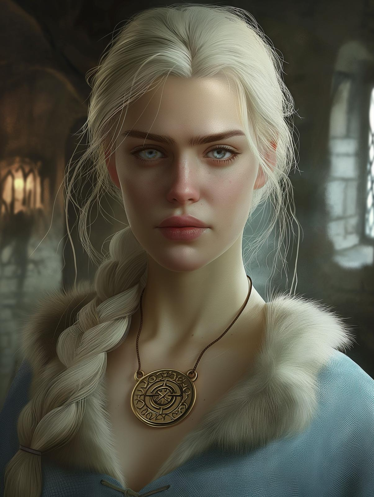

# Lena Sorokina

- :octicons-info-24:{ .lg .middle } __Biographical Information__

    An [Urskan](<../../gazetteer/northern-green-sea/ursk/ursk.md>) [human](<../../species/humans.md>) (she/her)  
    { .bio }

    Based in [Zvervinka](<../../gazetteer/northern-green-sea/ursk/zvervinka.md>), [Ursk](<../../gazetteer/northern-green-sea/ursk/ursk.md>)

{align="right"; width="400"}Lena is a member of the magical [Watchers](<../../groups/urskan-magical-organizations/eyes-of-vedmakov.md>), known for her political connection among several of the [rodnye](<../../groups/urskan-magical-organizations/rodnya.md>). She is also well-connected among the elite of [Zvervinka](<../../gazetteer/northern-green-sea/ursk/zvervinka.md>), though what her actual title and position in the [Watchers](<../../groups/urskan-magical-organizations/eyes-of-vedmakov.md>) is is not clear.

