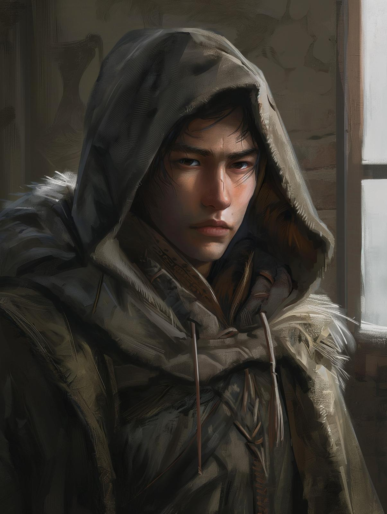

# Olen Vrask

- :octicons-info-24:{ .lg .middle } __Biographical Information__

    An [Urskan](<../../gazetteer/northern-green-sea/ursk.md>) [human](<../../species/children-of-divine-creation/humans/humans.md>) (he/him)  
    Member of the [Rodnya Voknaz](<../../groups/urskan-magical-organizations/rodnya-voknaz.md>)  
    { .bio }

{align="right"; width="400"}Olen is a secretary and scribe for [Branek Mirov](<./branek-mirov.md>).

