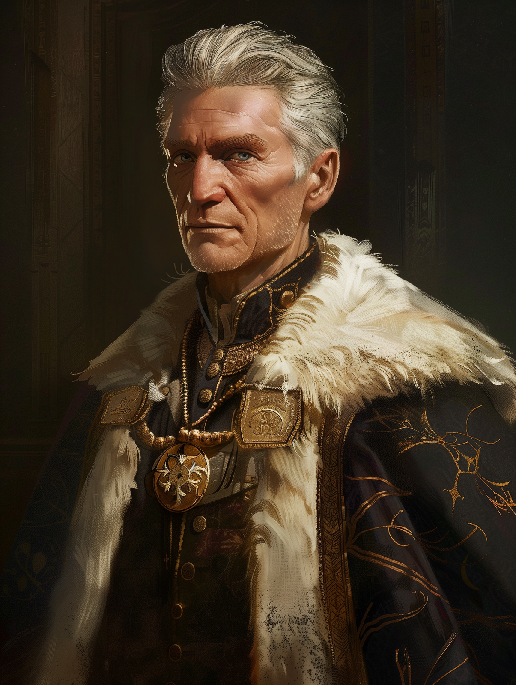

# Roman

- :octicons-info-24:{ .lg .middle } __Biographical Information__

    An [Urskan](<../../gazetteer/northern-green-sea/ursk/ursk.md>) [human](<../../species/humans.md>) (he/him)  
    Owner of [The Silver Wolf](<../../gazetteer/northern-green-sea/ursk/the-silver-wolf.md>)  
    { .bio }

    Based in [Zvervinka](<../../gazetteer/northern-green-sea/ursk/zvervinka.md>), [Ursk](<../../gazetteer/northern-green-sea/ursk/ursk.md>)

{align="right"; width="400"}Roman is a dapper, silver-haired gentleman who runs [The Silver Wolf](<../../gazetteer/northern-green-sea/ursk/the-silver-wolf.md>), a high-end inn and restaurant frequented by merchants in town for the famous markets of [Zvervinka](<../../gazetteer/northern-green-sea/ursk/zvervinka.md>). His impeccable manners mask his self-centered perspective; Roman is always on the lookout for an angle to improve things for himself. Nonetheless, he knows how to run a high-end inn, and his establishment is a hub for gossip and intrigue. 

