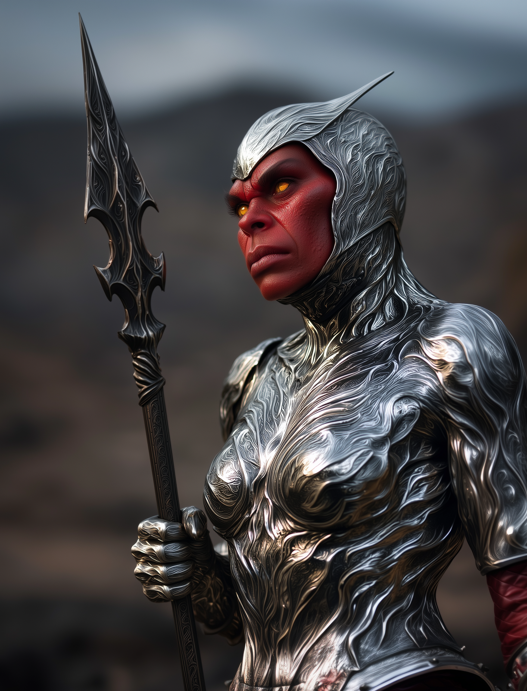

# Empress of Chaos

- :octicons-info-24:{ .lg .middle } __Biographical Information__

    A hobgoblin (she/her)  
    { .bio }

    Originally from: Unknown

:octicons-location-24:{ .lg .middle } Last known location (as of August 6th, 1749): the [Plaguelands](<../../gazetteer/upper-istaros/plaguelands.md>)

:octicons-location-24:{ .lg .middle } Met by the [Dunmar Fellowship](<../pcs/dunmar-fellowship/dunmar-fellowship.md>) on August 6th, 1749 in the [Plaguelands](<../../gazetteer/upper-istaros/plaguelands.md>)  

{align="right"; width="400"}The Empress of Chaos is the leader of the Iron Fang hobgoblin clan. 

