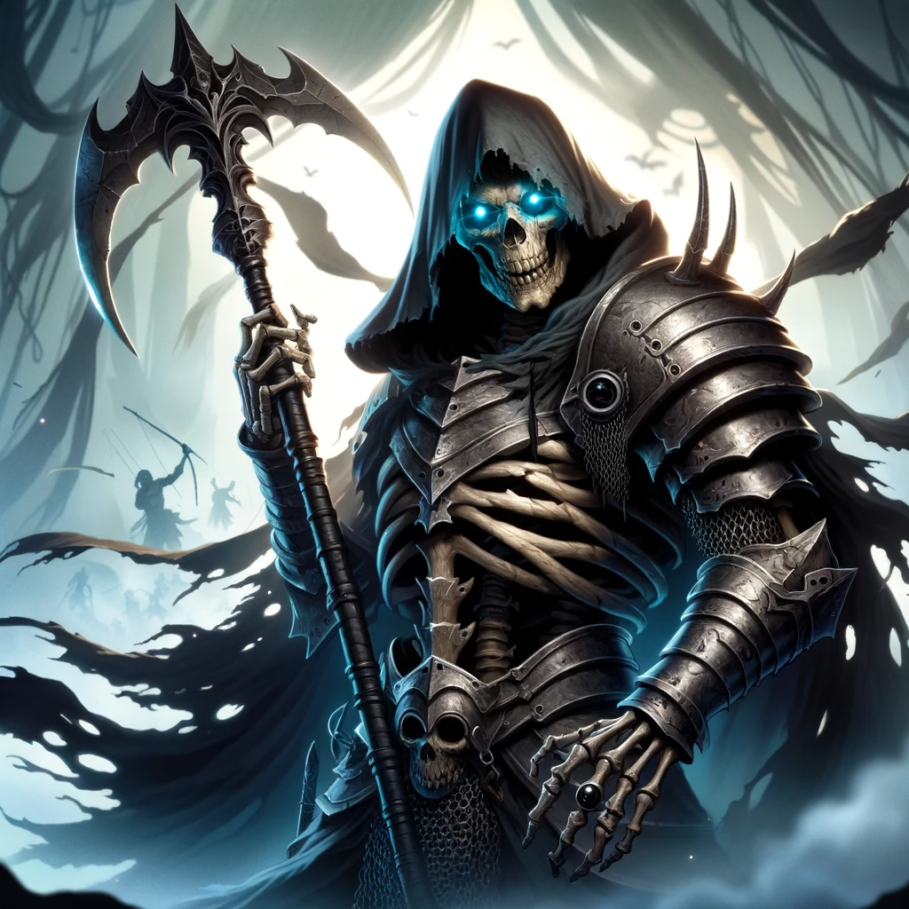

# Grash

- :octicons-info-24:{ .lg .middle } __Biographical Information__

    A skeletal undead (he/him)  
    Killed January 20th, 1749  
    { .bio }

    Originally from: Unknown

:octicons-location-24:{ .lg .middle } Killed in [Uzgukhar](<../../gazetteer/istaros-watershed/xurkhaz/uzgukhar.md>), [Xurkhaz](<../../gazetteer/istaros-watershed/xurkhaz/xurkhaz.md>), the [Garamjala Desert](<../../gazetteer/greater-dunmar/garamjala-plateau/garamjala-desert.md>)

:octicons-location-24:{ .lg .middle } Scryed by the [Dunmar Fellowship](<../pcs/dunmar-fellowship/dunmar-fellowship.md>) on December 28th, 1748 in [Uzgukhar](<../../gazetteer/istaros-watershed/xurkhaz/uzgukhar.md>), [Xurkhaz](<../../gazetteer/istaros-watershed/xurkhaz/xurkhaz.md>), the [Garamjala Desert](<../../gazetteer/greater-dunmar/garamjala-plateau/garamjala-desert.md>)  

:octicons-location-24:{ .lg .middle } Defeated by the [Dunmar Fellowship](<../pcs/dunmar-fellowship/dunmar-fellowship.md>) on January 20th, 1749 in [Uzgukhar](<../../gazetteer/istaros-watershed/xurkhaz/uzgukhar.md>), [Xurkhaz](<../../gazetteer/istaros-watershed/xurkhaz/xurkhaz.md>), the [Garamjala Desert](<../../gazetteer/greater-dunmar/garamjala-plateau/garamjala-desert.md>)  

{align="right"; width="320"}Known as Grash the Undying, an undead warrior and commander of a large [orc](<../../species/children-of-the-embodied-gods/orcs/orcs.md>) army in Kharsan. He possessed the [Ring of Undying](<../../things/artifacts-of-power/ring-of-undying.md>), and used it to create a large army of orcs and undead. 

Grash was rumored to once have been a knight from an unknown land, a warrior, skilled in battle, who sought glory in the [Nashtkar](<../../gazetteer/greater-dunmar/dunmari-basin/nashtkar.md>), and never returned. He became something of a rumor and legend, a haunted ghost to frighten children with. A knight of shadows who could cut wounds that would not heal with his glaive. A cursed warrior, who could summon chains of darkness to bind your heart and drag you closer to death. 

How he acquired the [Ring of Undying](<../../things/artifacts-of-power/ring-of-undying.md>), and how he found himself in [Apollyon](<../historical-figures/drankorian-emperors/apollyon.md>)'s service, are not known.