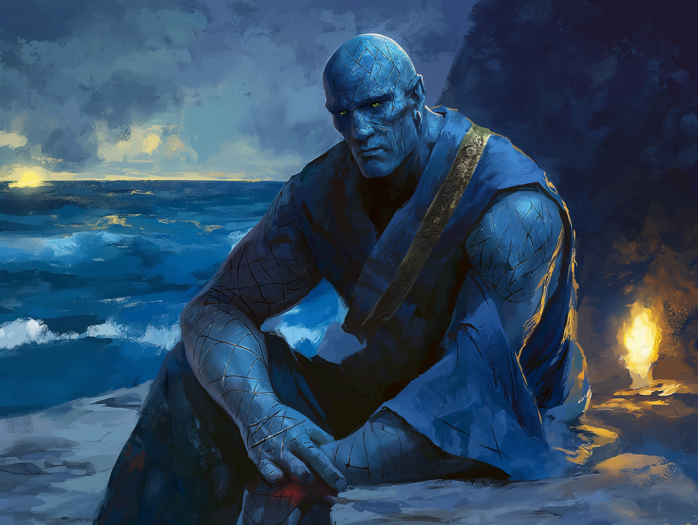

# Kazuro

- :octicons-info-24:{ .lg .middle } __Biographical Information__

    A [stoneborn](<../../species/stoneborn.md>) (he/him)  
    { .bio }

A stoneborn hermit living somewhere on the coast of [Cedrano](<../../gazetteer/greater-chardon/chardonian-empire/apporia/cedrano.md>), known for his skill in alchemy and attunement to the ocean. 

