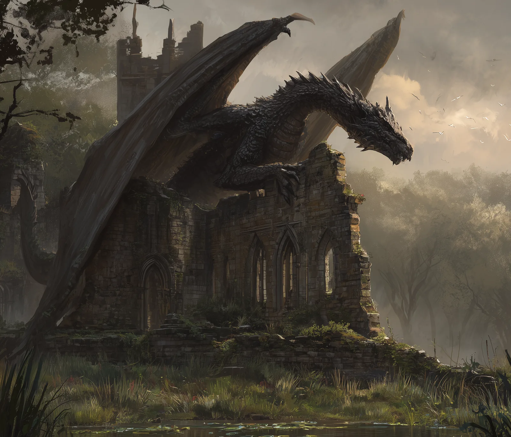

# Nymthrax

- :octicons-info-24:{ .lg .middle } __Biographical Information__

    A [dragon](<../../creatures/species/dragons.md>) (black dragon) (he/him)  
    Killed by the [Silver Tempests](<../pcs/silver-tempests/silver-tempests.md>) on February 15th, 1748  
    { .bio }

    Originally from: Unknown
    Lived in the [Blackwater Fens](<../../gazetteer/northern-sentinels/blackwater-fens.md>)

{align="right"; width="400"}A black dragon who established a lair in the  [Blackwater Fens](<../../gazetteer/northern-sentinels/blackwater-fens.md>) in the DR 1700s. As he grew in power in the DR 1730s and DR 1740s, his expanding sphere of influence disrupted the balance of power on the northern frontier, eventually creating the conditions for the growth in power of [Grumella's Horde](<../../groups/orc-hordes/grumella-s-horde.md>). 

In DR 1748, while investigating raids on Chardonian border forts caused by displaced [Bullywugs](<../../creatures/bestiary/bullywugs.md>), the [Silver Tempests](<../pcs/silver-tempests/silver-tempests.md>), along with the [Deno'qai](<../../groups/cultures/deno-qai-tribes/deno-qai.md>) godcaller Izkir, met and eventually killed Nymthrax. 

Her lair contained many treasures from lost kingdoms of the north that were destroyed during and after the [Great War](<../../events/1500s/great-war.md>).

