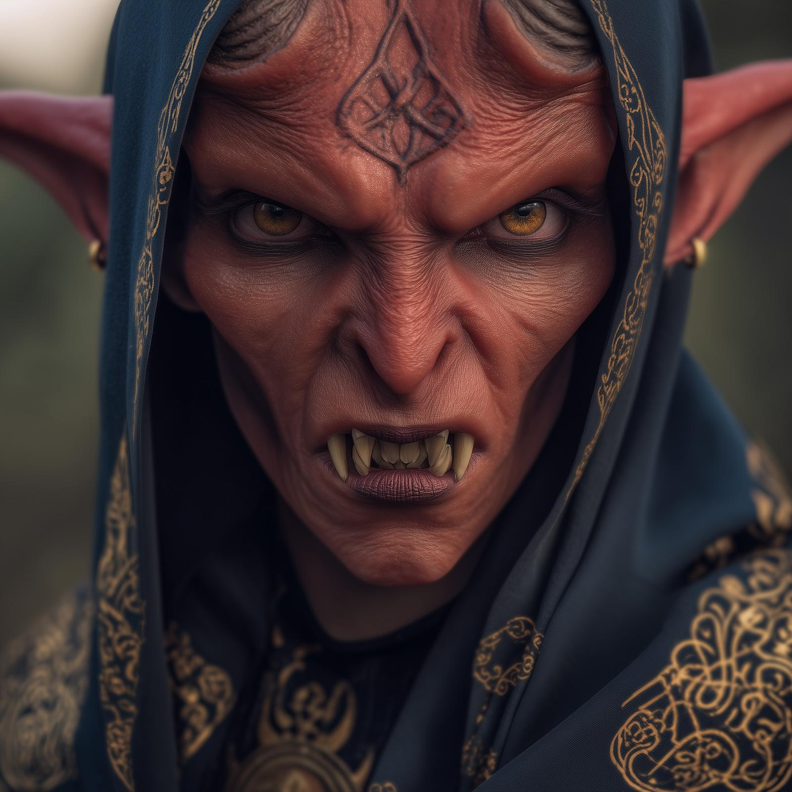

# Revaka

- :octicons-info-24:{ .lg .middle } __Biographical Information__

    A hobgoblin (she/her)  
    { .bio }

    Originally from: Unknown

:octicons-location-24:{ .lg .middle } Currently trapped in the [Mirror of Soul Trapping](<../../campaigns/dunmari-frontier-campaign/treasure/mirror-of-soul-trapping.md>), [Vindristjarna](<../../things/ships/vindristjarna.md>)

:octicons-location-24:{ .lg .middle } Interrogated by the [Dunmar Fellowship](<../pcs/dunmar-fellowship/dunmar-fellowship.md>) on June 15th, 1748 in the [Mirror of Soul Trapping](<../../campaigns/dunmari-frontier-campaign/treasure/mirror-of-soul-trapping.md>)  

:octicons-location-24:{ .lg .middle } Interrogated by the [Dunmar Fellowship](<../pcs/dunmar-fellowship/dunmar-fellowship.md>) on May 20th, 1749 in the [Mirror of Soul Trapping](<../../campaigns/dunmari-frontier-campaign/treasure/mirror-of-soul-trapping.md>)  

{align="right"; width="350"}A hobgoblin who has been trapped in the [Mirror of Soul Trapping](<../../campaigns/dunmari-frontier-campaign/treasure/mirror-of-soul-trapping.md>) for centuries. A fairly powerful sorcerer from before the [Great War](<../../events/1500s/great-war.md>), trapped by [Cha'mutte](<../extraplanar-powers/cha-mutte.md>) for refusing to join his war. 

