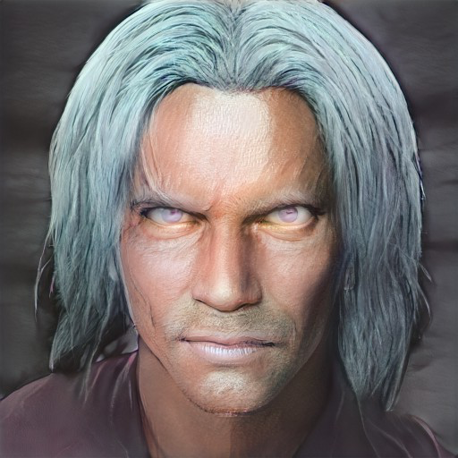

# Tharandros
:speaker:{ .middle } *(tha-RAN-dros)*  

- :octicons-info-24:{ .lg .middle } __Biographical Information__

    { .bio }

:octicons-location-24:{ .lg .middle }   

{align="right"; width="500"}A centaur, the leader of a herd who the party met traveling across the northern plains of [Dunmar](<../../gazetteer/greater-dunmar/realms/dunmar/dunmar.md>). Convinced to aid [Karawa](<../../gazetteer/greater-dunmar/realms/dunmar/eastern-dunmar/karawa.md>), and proved crucial in driving off gnoll attacks. 

Left to travel north in [Session 29 (DuFr)](<../../campaigns/dunmari-frontier/session-notes/session-29-dufr.md>), around 1 June 1748. 

