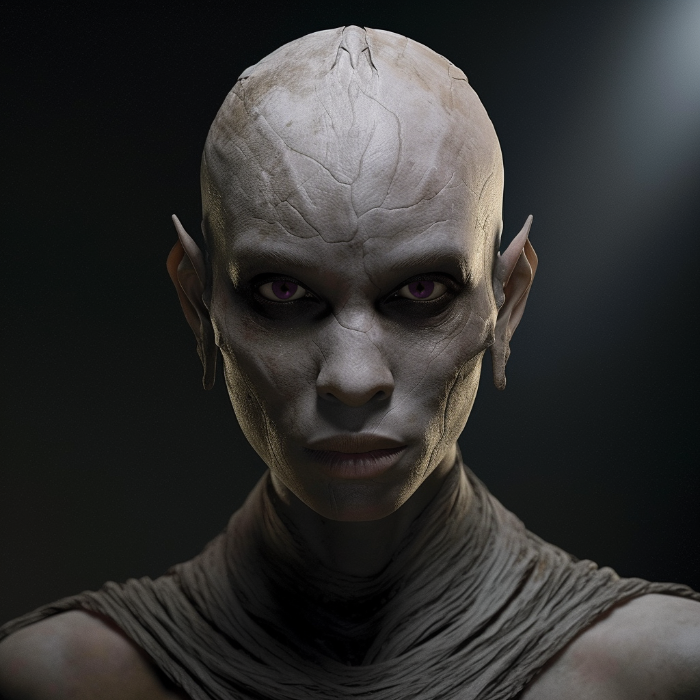

# Umli the Exile

- :octicons-info-24:{ .lg .middle } __Biographical Information__

    A [stoneborn](<../../creatures/species/stoneborn.md>) (she/her)  
    Born DR 1666 (84 years old)  
    { .bio }

    Exiled from the Sivnjo Mountains in DR 1731
    Based in the [Free City of Tollen](<../../gazetteer/greater-sembara/tollen/tollen.md>) (for 18 years)

:octicons-location-24:{ .lg .middle } Met by the [Dunmar Fellowship](<../pcs/dunmar-fellowship/dunmar-fellowship.md>) on December 29th, 1748 in the [Free City of Tollen](<../../gazetteer/greater-sembara/tollen/tollen.md>)  

{align="right"; width="320"}Umli is tall, imposing stoneborn, with gray skin marked with intricate patterns reminiscent of intertwining metalwork and intense obsidian-like eyes. She is a master metalworker and smith, known for her unparalleled mastery of metallurgy and her knowledge of the elemental plane of fire. 

