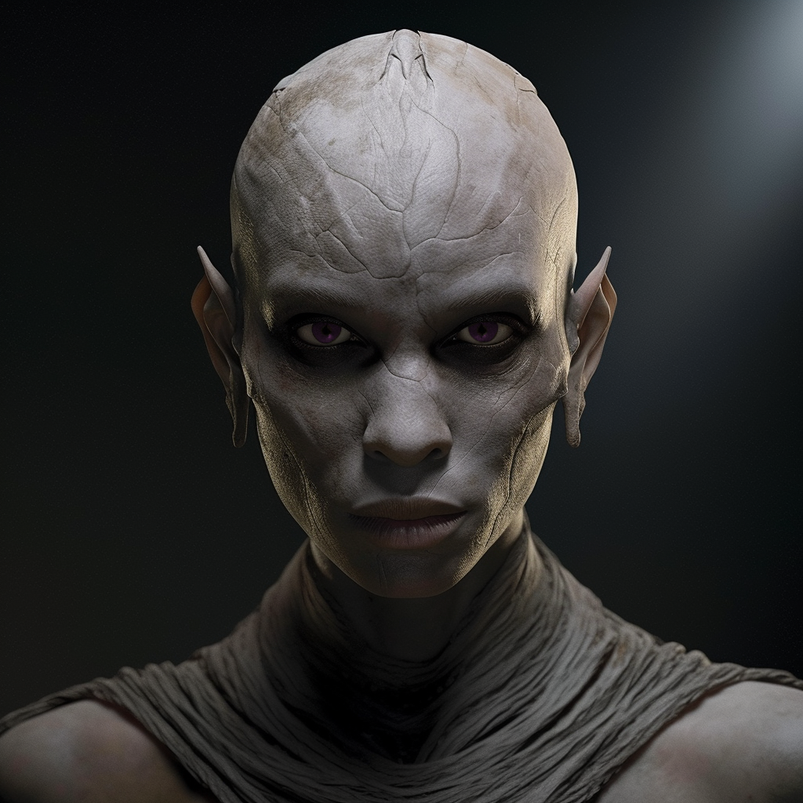

# Umli the Exile

- :octicons-info-24:{ .lg .middle } __Biographical Information__

    A [stoneborn](<../../species/children-of-the-embodied-gods/stoneborn/stoneborn.md>) (she/her)  
    Born DR 1666 (83 years old)  
    { .bio }

    Originally from: ~VostokMountains~
    Based in the [Free City of Tollen](<../../gazetteer/western-green-sea/tollen/tollen.md>)

:octicons-location-24:{ .lg .middle } Met by the [Dunmar Fellowship](<../pcs/dunmar-fellowship/dunmar-fellowship.md>) on December 29th, 1748 in the [Free City of Tollen](<../../gazetteer/western-green-sea/tollen/tollen.md>)  

Umli is a stoneborn exile living in [Tollen](<../../gazetteer/western-green-sea/tollen/tollen.md>), a master metalworker, and a teacher. 

## Overview

Umli is a stoneborn smith and metalworker, known for her unparalleled mastery of metallury and her knowledge of the elemental plane of fire. Though loosely affiliated with the University of [Tollen](<../../gazetteer/western-green-sea/tollen/tollen.md>), she  does not teach open lectures. She only takes private students who are the most skilled and dedicated at working with rare metals. Born in the Vostok mountains, she was exiled from her Stoneborn community for reasons she keeps private, and has lived in [Tollen](<../../gazetteer/western-green-sea/tollen/tollen.md>) for the past 15 years. 
## Description

Umli stands tall and imposing, typical of stoneborn, with gray skin marked with intricate patterns reminiscent of intertwining metalwork. Her obsidian-like eyes reflect her intense focus.

## Rumors and Information

- There are murmurs of Umli once attempting a creation using a metal sourced from a location she keeps secret. Whether this is related to her exile, none will speculate, for Umli is quick to anger if she learns anyone speculating about the reasons for her exile. 
- Umli is exceedingly private. She never takes visitors in her home/forge, and usually takes her meals alone.
- Once a week, on Tuesdays, she takes interviews for new students in a dwarven tavern near campus called *Fire and Stone*, and will also sometimes speak to clients desiring her skills in smithing then as well. 
- Once a week, on Fridays, she tests her student's work at her forge. No one is allowed in, but a crowd gathers outside and she takes each item presented to examine. 

