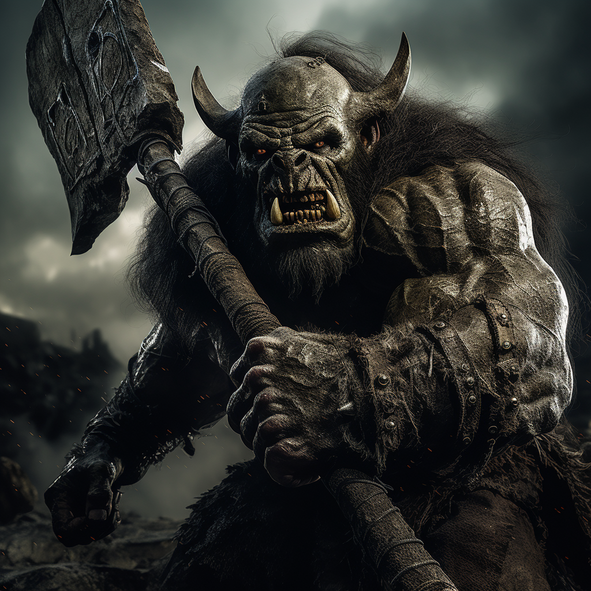

# Wakog

- :octicons-info-24:{ .lg .middle } __Biographical Information__

    An ogre (he/him)  
    Died December 6th, 1719  
    { .bio }

    Lived in [Wakog's Camp](<../../gazetteer/greater-sembara/duchy-of-maseau/wakog-s-camp.md>), the [Duchy of Maseau](<../../gazetteer/greater-sembara/duchy-of-maseau/duchy-of-maseau.md>)

{align="right"; width="320"}An ogre of unclear origin. Managed to organize a small horde of orcs, and attempted to overrun [Cleenseau](<../../gazetteer/greater-sembara/sembara/barony-of-aveil/cleenseau-region/cleenseau/cleenseau.md>), but was stopped by the [Heroes of Cleenseau](<../pcs/cleenseau/heroes-of-cleenseau.md>).